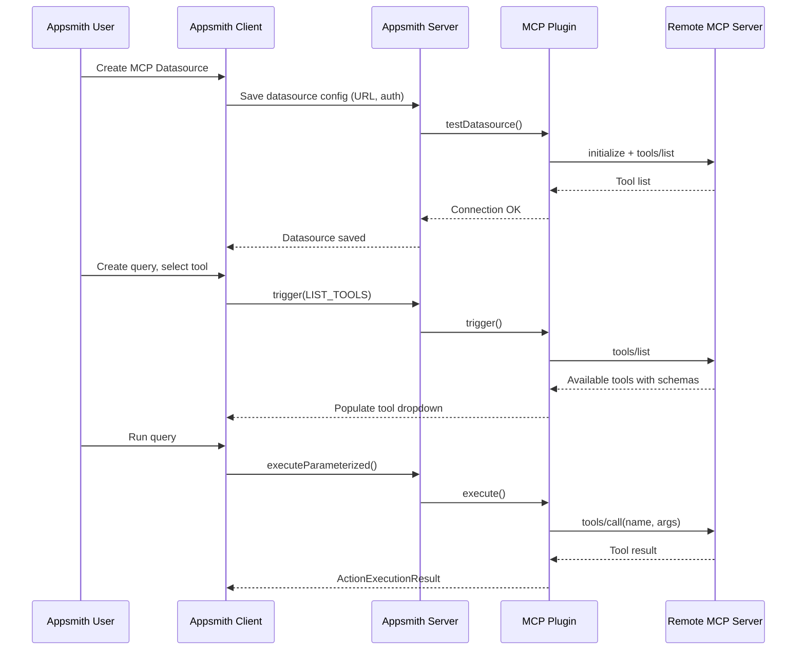

# MCP Datasource Plugin for Appsmith

## Architecture Overview




## Dependencies

- **MCP Java SDK**: `io.modelcontextprotocol.sdk:mcp` (v1.0.0) -- official Java SDK from Anthropic/Spring
  - Provides `McpSyncClient`, `HttpClientSseClientTransport`, JSON-RPC protocol handling
  - Uses Java's built-in `HttpClient` (no Spring WebFlux dependency needed for SSE transport)
  - Appsmith already runs Java 17+, which is the SDK's minimum requirement

---

## Phase 1: Server-Side Plugin Module

### 1.1 Create plugin module structure

New directory: `app/server/appsmith-plugins/mcpPlugin/`

```
mcpPlugin/
  pom.xml
  src/main/java/com/external/plugins/
    McpPlugin.java              -- Plugin class + executor
    McpConnectionManager.java   -- MCP client lifecycle (connect, cache, disconnect)
    McpToolService.java         -- Tool listing and invocation logic
  src/main/resources/
    plugin.properties           -- PF4J descriptor
    form.json                   -- Datasource config form (URL, auth)
    setting.json                -- Action settings (timeout, run behavior)
    editor/
      root.json                 -- Action editor with tool selector dropdown
      callTool.json             -- Tool invocation form (name, arguments)
  src/test/java/...             -- Unit tests
```

### 1.2 `pom.xml`

Follow the pattern from [appsmithAiPlugin/pom.xml](app/server/appsmith-plugins/appsmithAiPlugin/pom.xml). Key additions:

- Parent: `com.appsmith:appsmith-plugins`
- Artifact: `mcpPlugin`
- New dependency: `io.modelcontextprotocol.sdk:mcp:1.0.0`

Register in parent POM: add `<module>mcpPlugin</module>` to [app/server/appsmith-plugins/pom.xml](app/server/appsmith-plugins/pom.xml).

### 1.3 `plugin.properties`

```properties
plugin.id=mcp-plugin
plugin.class=com.external.plugins.McpPlugin
plugin.version=1.0-SNAPSHOT
plugin.provider=tech@appsmith.com
plugin.dependencies=
```

### 1.4 `McpPlugin.java` -- Main plugin class

- `McpPlugin extends BasePlugin`
- Inner static class `McpPluginExecutor implements PluginExecutor<McpSyncClient>`
  - Does NOT extend `BaseRestApiPluginExecutor` (MCP uses its own protocol, not plain REST)
  - Annotated with `@Extension`

Key method implementations:

- `**datasourceCreate(DatasourceConfiguration)**`: Create `HttpClientSseClientTransport` from the configured URL, build `McpSyncClient`, call `client.initialize()`, return the client
- `**datasourceDestroy(McpSyncClient)**`: Call `client.close()` to clean up
- `**validateDatasource(DatasourceConfiguration)**`: Check URL is non-empty and valid
- `**testDatasource(DatasourceConfiguration)**`: Create a temporary client, call `initialize()` + `listTools()`, verify response, close client
- `**executeParameterized(McpSyncClient, ExecuteActionDTO, DatasourceConfiguration, ActionConfiguration)**`: Extract tool name and arguments from `formData`, call `client.callTool(new CallToolRequest(toolName, argsMap))`, convert `CallToolResult` to `ActionExecutionResult`
- `**trigger(McpSyncClient, DatasourceConfiguration, TriggerRequestDTO)**`: Handle `LIST_TOOLS` request type -- call `client.listTools()`, format as dropdown options `[{label, value}]` for the UI

### 1.5 `McpConnectionManager.java`

Manages MCP client connections. Since `McpSyncClient` is stateful (maintains an SSE connection), we need to handle:

- Creating clients with proper auth headers (Bearer token added to `HttpClient` default headers)
- Connection timeout and error handling
- The Appsmith `DatasourceContext` system already caches connections per datasource -- leverage that by returning `McpSyncClient` from `datasourceCreate()`

### 1.6 `McpToolService.java`

Encapsulates MCP tool operations:

- `listTools(McpSyncClient)` -- returns `ListToolsResult` formatted for the UI trigger dropdown
- `callTool(McpSyncClient, String toolName, Map args)` -- invokes a tool and converts the result
- Handles MCP error responses and maps them to Appsmith `ActionExecutionResult` with proper error messages

---

## Phase 2: Form Configurations (Drives the UI)

### 2.1 `form.json` -- Datasource Configuration Form

This defines what the user sees when creating/editing an MCP datasource. Rendered automatically by Appsmith's form system.

```json
{
  "form": [
    {
      "sectionName": "Connection",
      "children": [
        {
          "label": "MCP Server URL",
          "configProperty": "datasourceConfiguration.url",
          "controlType": "INPUT_TEXT",
          "placeholderText": "https://your-mcp-server.example.com/sse",
          "isRequired": true
        }
      ]
    },
    {
      "sectionName": "Authentication",
      "children": [
        {
          "label": "Authentication type",
          "configProperty": "datasourceConfiguration.authentication.authenticationType",
          "controlType": "DROP_DOWN",
          "initialValue": "none",
          "options": [
            { "label": "None", "value": "none" },
            { "label": "Bearer token", "value": "bearerToken" }
          ]
        },
        {
          "label": "Bearer token",
          "configProperty": "datasourceConfiguration.authentication.bearerToken",
          "controlType": "INPUT_TEXT",
          "dataType": "PASSWORD",
          "isRequired": true,
          "hidden": {
            "path": "datasourceConfiguration.authentication.authenticationType",
            "comparison": "NOT_EQUALS",
            "value": "bearerToken"
          }
        }
      ]
    }
  ]
}
```

### 2.2 `editor/root.json` -- Action Editor

Defines the query editor UI. Uses `fetchOptionsConditionally` to dynamically populate the tool dropdown from the MCP server (via the `trigger()` method).

```json
{
  "editor": [
    {
      "controlType": "SECTION_V2",
      "identifier": "TOOL_SELECTOR",
      "children": [
        {
          "controlType": "DOUBLE_COLUMN_ZONE",
          "children": [
            {
              "label": "Tool",
              "description": "Select an MCP tool to invoke",
              "configProperty": "actionConfiguration.formData.toolName.data",
              "controlType": "DROP_DOWN",
              "isRequired": true,
              "placeholderText": "Select a tool",
              "fetchOptionsConditionally": true,
              "conditionals": {
                "enable": "{{true}}",
                "fetchDynamicValues": {
                  "condition": "{{true}}",
                  "config": {
                    "params": {
                      "requestType": "LIST_TOOLS",
                      "displayType": "DROP_DOWN"
                    }
                  }
                }
              }
            }
          ]
        }
      ]
    }
  ],
  "files": ["callTool.json"]
}
```

### 2.3 `editor/callTool.json` -- Tool Arguments Form

Provides a JSON input field for tool arguments. The tool's `inputSchema` (from `tools/list`) can be shown as a description/tooltip to guide the user.

```json
{
  "controlType": "SECTION_V2",
  "identifier": "CALL_TOOL",
  "conditionals": {
    "show": "{{actionConfiguration.formData.toolName.data}}"
  },
  "children": [
    {
      "controlType": "SINGLE_COLUMN_ZONE",
      "children": [
        {
          "label": "Arguments",
          "subtitle": "JSON object matching the tool's input schema. Use {{ }} for dynamic values.",
          "configProperty": "actionConfiguration.formData.toolArgs.data",
          "controlType": "QUERY_DYNAMIC_INPUT_TEXT",
          "placeholderText": "{ \"key\": \"value\" }",
          "isRequired": false,
          "initialValue": "{}",
          "evaluationSubstitutionType": "TEMPLATE"
        }
      ]
    }
  ]
}
```

### 2.4 `setting.json` -- Action Settings

Standard action settings (timeout, run behavior). Can reuse the pattern from AI plugin or any UQI plugin.

---

## Phase 3: Plugin Registration

### 3.1 Add plugin constants

**File:** [app/server/appsmith-interfaces/src/main/java/com/appsmith/external/constants/PluginConstants.java](app/server/appsmith-interfaces/src/main/java/com/appsmith/external/constants/PluginConstants.java)

- Add `MCP_PLUGIN_NAME = "MCP"` to `PluginName`
- Add `MCP_PLUGIN = "mcp-plugin"` to `PackageName`

### 3.2 Database migration

Create: `app/server/appsmith-server/src/main/java/com/appsmith/server/migrations/db/ce/Migration0XXAddMcpPlugin.java`

Follow the exact pattern from [Migration040AddAppsmithAiPlugin.java](app/server/appsmith-server/src/main/java/com/appsmith/server/migrations/db/ce/Migration040AddAppsmithAiPlugin.java):

- `plugin.setName("MCP")`
- `plugin.setType(PluginType.API)` -- use API type since MCP is a remote protocol (or consider adding a new `MCP` type if we want distinct categorization in the UI)
- `plugin.setPackageName("mcp-plugin")`
- `plugin.setUiComponent("UQIDbEditorForm")` -- uses the UQI form system
- `plugin.setDatasourceComponent("DbEditorForm")`
- `plugin.setResponseType(Plugin.ResponseType.JSON)`
- `plugin.setDefaultInstall(true)`
- `installPluginToAllWorkspaces()`

### 3.3 Determine the next migration order number

Check the highest existing migration number in `app/server/appsmith-server/src/main/java/com/appsmith/server/migrations/db/ce/` and use the next sequential number.

---

## Phase 4: Client-Side Updates

Most of the UI is auto-generated from the JSON form configs. These are the explicit client-side changes needed:

### 4.1 Add plugin package name constant

**File:** [app/client/src/entities/Plugin/index.ts](app/client/src/entities/Plugin/index.ts)

Add to the `PluginPackageName` enum:

```typescript
MCP_PLUGIN = "mcp-plugin"
```

### 4.2 Plugin icon

- Add an MCP icon SVG (e.g., `https://assets.appsmith.com/logo/mcp.svg` or bundle it)
- Reference in the migration: `plugin.setIconLocation("...")`

### 4.3 Verify UQI form rendering for trigger-based dropdowns

The `fetchOptionsConditionally` mechanism in `editor/root.json` should work out of the box because:

- The server `trigger()` method returns `TriggerResultDTO` with dropdown options
- The client `FormControl` system already handles `fetchOptionsConditionally` for any plugin
- This is the same pattern the AI plugin uses for its file picker dropdown

No custom client components should be needed for the initial version.

### 4.4 Datasource list categorization (optional)

If using `PluginType.API`, MCP will appear in the API section of the datasource creation dialog. If a distinct section is preferred, either:

- Add `PluginType.MCP` to both server and client enums, or
- Use a display tag/category on the `Plugin` entity

---

## Phase 5: Testing

### 5.1 Server unit tests

- `McpPluginTest.java`: Test `validateDatasource`, `testDatasource`, `executeParameterized`, `trigger`
- Mock the `McpSyncClient` to avoid needing a real MCP server
- Test error handling: invalid URL, auth failure, unknown tool, malformed arguments

### 5.2 Client integration

- Verify the datasource creation form renders correctly from `form.json`
- Verify the tool dropdown populates via trigger
- Verify tool execution returns results to the response panel

### 5.3 Manual E2E test

- Stand up a simple MCP server (e.g., using the MCP TypeScript SDK)
- Connect from Appsmith as a datasource
- List tools, invoke one, verify result

---

## Key Design Decisions

- **Why `PluginExecutor<McpSyncClient>` instead of extending `BaseRestApiPluginExecutor`?** MCP uses JSON-RPC over SSE, not standard REST. The MCP Java SDK handles protocol details internally. Using it directly is cleaner than shoehorning it into REST abstractions.
- **Why `McpSyncClient` over `McpAsyncClient`?** The `PluginExecutor` interface wraps everything in `Mono<>` already. Using the sync client inside a `Mono.fromCallable()` is simpler and avoids double-reactive complexity. Can switch to async later if needed.
- **Why dynamic tool discovery via `trigger()` instead of hardcoded dropdown?** Every MCP server exposes different tools. The trigger mechanism fetches the real tool list at query-edit time, which is exactly what the AI plugin does for its file picker. This gives users an always-up-to-date view of available tools.
- **Why start with `PluginType.API`?** Avoids adding a new enum value across server + client + tests. Can be changed to a dedicated `MCP` type later if the UI needs to categorize it differently.

