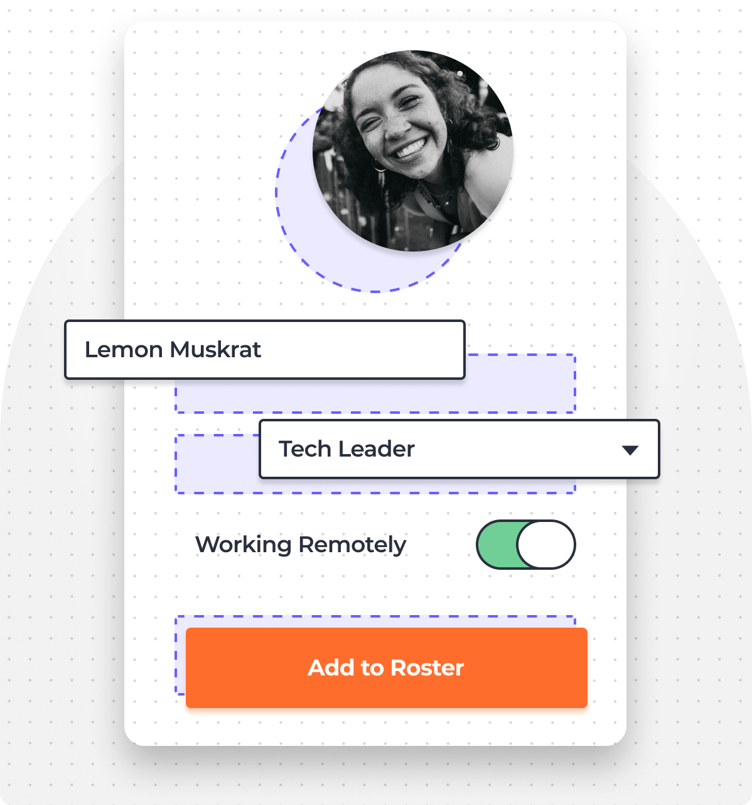
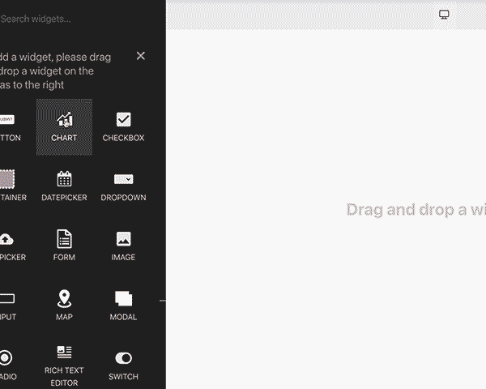
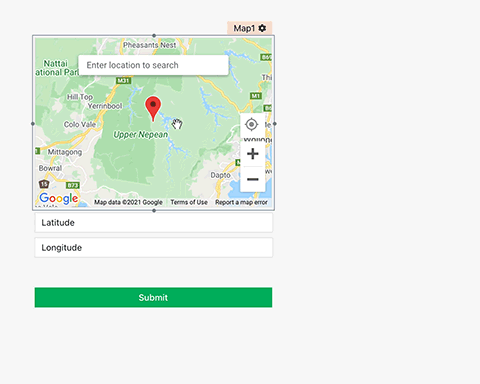
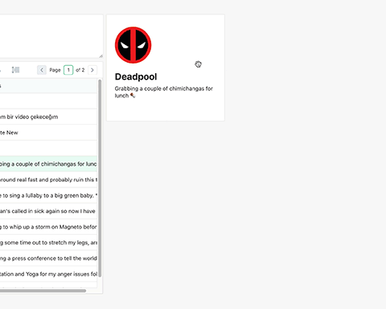

  <b><a href="https://app.appsmith.com/signup">Start Building</a></b>
    •
  <a href="https://www.appsmith.com/">Features</a>
    •
  <a href="https://docs.appsmith.com/">Documentation</a>
   
   
  Turn any datasource into an internal app in minutes. Appsmith lets you drag-and-drop components to build dashboards, write logic with JavaScript objects and connect to any API, database or GraphQL source.
   
   

   

## Quick Start

The fastest way to start with Appsmith is the cloud-hosted version. When you're ready, you can also host it yourself.

- Start building apps _2 minutes_ with [Appsmith Cloud](https://bit.ly/appsmith-signup-github)
- Install locally or on a private instance with [Docker](https://docs.appsmith.com/setup/docker) _(Recommended)_
- Deploy on a [Kubernetes](https://docs.appsmith.com/setup/kubernetes) cluster
- Deploy to [AWS with an AMI](https://docs.appsmith.com/setup/aws-ami) on the marketplace
- One-click deploy to [Heroku](https://docs.appsmith.com/setup/heroku)

 

### Demos

Check out some real applications that can be built with Appsmith:

- 👩‍💻 [Customer Support Dashboard](https://bit.ly/cs-dashboard-appsmith)
- 💼 [Job Application Tracker](https://bit.ly/3hbYtTi)
- 🌟 Made something cool? [Share it with the community](https://discord.gg/Tx395War)
    

## Features

  
  
  

#### ↗️ Drag & Drop UI

Use [ready components](https://docs.appsmith.com/widget-reference/button) to build workflows in record time. Drag common elements like tables, charts, forms and more right into your app.

> _Includes text, forms, inputs, buttons, tables, images, charts, checkboxes, switches, radio buttons, datepickers, dropdowns, filepickers, containers, maps, modals, rich text editors, tabs & video_ >  

#### ⏱ Quick Integrations

Appsmith automagically works using any DB, Rest API or GraphQL as a datasource, with support for OAuth 2.0 and CURL. Here's a list of all our [pre-built integrations](https://docs.appsmith.com/core-concepts/connecting-to-data-sources/connecting-to-databases).

> _Currently works with PostgreSQL, MongoDB, MySQL, Firestore, S3, Redshift, Elastic Search, DynamoDB, Redis, and MSFT SQL Server_ >  

#### 🤖 Code Logic with JavaScript

All parts of your app can be referenced as JavaScript objects. Code interactions between elements, update datasources or manipulate SQL queries—[we'll parse JS anywhere](https://docs.appsmith.com/core-concepts/writing-code).  

#### ☝️ One-click Deploy & Access Control

[Push a button](https://docs.appsmith.com/core-concepts/access-control) to make your app public and get a shareable link, or privately invite your team using OAuth 2.0. Each member can be assigned a role with access to certain parts of the app.  

#### 🔑 Solid 256-bit Encryption

Appsmith apps are [secure by default](https://docs.appsmith.com/security). All connections are TLS-encrypted, and credentials are encrypted with AES-256—so we can't see any of your data. For added security, try our [self-hosted options](https://docs.appsmith.com/setup).  

#### 🎙 Transparent Support

Issues are inevitable. When you have one, our entire team is around to help—

- 💬 Talk to us on [Discord](https://discord.gg/rBTTVJp)
- 📄 Find a solution in our [Documentation](https://docs.appsmith.com)
- ⚠️ Open an issue right here on [GitHub](https://github.com/appsmithorg/appsmith/issues/new/choose)
    

## Contribute

We love our contributors! We're committed to fostering an open and welcoming environment in the community. If you'd like to contribute anything from a bug-fix to a feature update, start here—

- 📖 Read our [Contribution Guide](https://github.com/appsmithorg/appsmith/blob/master/CONTRIBUTING.md)
- 🧩 [Set up your local environment](https://github.com/appsmithorg/appsmith/blob/master/contributions/CodeContributionsGuidelines.md#-setup-for-local-development)
- 👾 Explore some [good first issues](https://github.com/appsmithorg/appsmith/issues?q=is%3Aissue+is%3Aopen+label%3A%22Good+First+Issue%22)
- 📕 Read our [Code of Conduct](CODE_OF_CONDUCT.md)

#### Currently Contributing (36)

<!-- ALL-CONTRIBUTORS-LIST:START - Do not remove / modify this section -->
<!-- prettier-ignore-start -->
<!-- markdownlint-disable -->

 
<!-- markdownlint-restore -->
<!-- prettier-ignore-end -->

<!-- ALL-CONTRIBUTORS-LIST:END -->

## License

Appsmith is available under the [Apache License 2.0](https://www.apache.org/licenses/LICENSE-2.0). Use it wisely.
