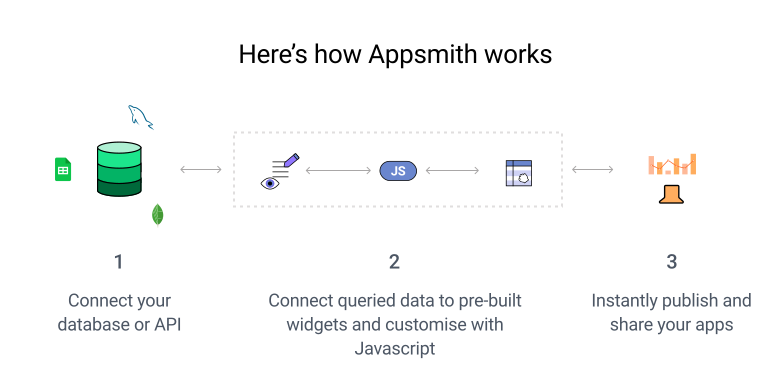

  

 

Appsmith is an open-source platform to build, deploy, and maintain internal apps. You can build anything from simple CRUD apps, admin panels, dashboards to custom business apps and complicated multi-step workflows.

<h3 align="center">
  <b><a href="https://app.appsmith.com/signup/">Get Started</a></b>
  •
  <b><a href="https://www.youtube.com/appsmith">YouTube</a></b>
  •
  <b><a href="https://www.appsmith.com/templates?utm_source=github&utm_medium=organic&utm_campaign=readme&utm_content=top">Templates</a></b> 
</h3>

 

---

## Build Apps in 4 Steps

### 1. Build your UI

Build your UI with our drag and drop UI builder. Use 45+ pre-built, customizable widgets including tables, charts, lists, modals, forms, and more. [Docs](https://docs.appsmith.com/core-concepts/dynamic-ui?utm_source=github&utm_medium=organic&utm_campaign=readme)

### 2. Connect to your data

Connect to your data with our connectors: databases (PostgresQL, MongoDB, Amazon S3, and many more), SaaS providers (like Google Sheets, Airtable, Twilio) or any GraphQL/REST API. [Docs](https://docs.appsmith.com/core-concepts/connecting-to-data-sources?utm_source=github&utm_medium=organic&utm_campaign=readme)

### 3. Connect the data to the UI

Connect the data to the UI by configuring the components. Where needed, you can use the Javascript IDE to create more advanced features and data transformations - the sky is the limit! [Docs](https://docs.appsmith.com/core-concepts/connecting-to-data-sources/querying-a-database?utm_source=github&utm_medium=organic&utm_campaign=readme)

### 4. Deploy your app

Deploy your app on our free, cloud-hosted version or to any platform of your choice - Docker, Kubernetes, AWS, DigitalOcean, Heroku, and more. [Docs](https://docs.appsmith.com/setup?utm_source=github&utm_medium=organic&utm_campaign=readme&utm_content=step4)

## Features

Appsmith makes it easy to create powerful utility applications organized across multiple workspaces. Here are a few notable features of Appsmith. We ship new features, bug fixes, and performance improvements regularly. Read our [release notes](https://github.com/appsmithorg/appsmith/releases) to stay updated.

🔥 **UI builder** with a library of [45+ widgets](https://docs.appsmith.com/reference/widgets?utm_source=github&utm_medium=organic&utm_campaign=readme) such as

- Tables
- Charts
- Forms
- Lists
- Buttons
- Checkboxes
- Filepicker
- Modals
  ...and more. All widgets come with properties that can be visually edited to set their data, change their styles, and trigger actions from them.

❇️ **Native integrations** available with the following databases. You can also connect with most other tools through the RESTful API plugin or using our SaaS connectors.

- PostgresSQL
- MongoDB
- MySQL
- Elasticsearch
- DynamoDB
- Redis
- Microsoft SQL Server
- Firestore
- Redshift
- S3
- Snowflake
- ArangoDB
- SMTP

🛠️ **API client and query builder** lets you run RESTful API, GraphQL, or database queries within connected datasources.

🚀 **JavaScript code support**. You can use JavaScript inside `{{ }}` anywhere in Appsmith. You can reference every entity in Appsmith as a JavaScript variable and perform all JavaScript functions and operations on them. Our in-built JS editor gives the full IDE experience with multiline editing, autocomplete, linting and debugging.

🔄 **Version control with Git** allows multiple developers to add their work in a git branch, raise a pull request for code reviews, integrate with CI/CD pipelines, and provide a commit history to go back to a previous version if something were to go wrong. You can connect to any popular version control tool of our liking: GitHub, Gitlab, Bitbucket, AWS Code Commit and more.

🎨 **App theming** to style your app pages and widgets and to customize the visual layout of your app in one click.

⚙️ **Access control** available to assign different roles to different team members while sharing the app. Appsmith implements RBAC by assigning a set of permissions to different user roles. These permissions determine the actions users can take on the platform. You can allow external users to access applications built using Appsmith by inviting them to the workspace.

🔑 [**Solid 256-bit encryption**](https://docs.appsmith.com/security?utm_source=github&utm_medium=organic&utm_campaign=readme). Appsmith apps are secure by default. All connections are TLS-encrypted, and credentials are encrypted with AES-256 so we can't see any of your data. For added security, try our [self-hosted options](https://docs.appsmith.com/setup?utm_source=github&utm_medium=organic&utm_campaign=readme&utm_content=features).

## Support and Community

Issues are inevitable. When you have one, our entire team and our active developer community is around to help. 

💬 Talk to us on [Discord](https://discord.gg/rBTTVJp) 
📄 Find a solution in our [Documentation](https://docs.appsmith.com?utm_source=github&utm_medium=organic&utm_campaign=readme) 
⚠️ Open an issue right here on [GitHub](https://github.com/appsmithorg/appsmith/issues/new/choose) 
👾 Ask for help on our [Forum](https://community.appsmith.com) 
💡Use our learning resources: [Templates](https://www.appsmith.com/templates?utm_source=github&utm_medium=organic&utm_campaign=readme&utm_content=support), [Tutorials](https://www.appsmith.com/blog-categories/tutorial?utm_source=github&utm_medium=organic&utm_campaign=readme), and [Videos](https://www.youtube.com/appsmith) 

## Deployment Options

While you can always start building apps right away using the [cloud-hosted version](https://app.appsmith.com/signup/), here are the resources for deploying Appsmith on different platforms:

| Cloud Provider                                                                                                                 | Documentation                                                                                                                                                    |
| ------------------------------------------------------------------------------------------------------------------------------ | ---------------------------------------------------------------------------------------------------------------------------------------------------------------- |
|                    | [Local/Cloud - Docs](https://docs.appsmith.com/getting-started/setup/installation-guides/docker?utm_source=github&utm_medium=organic&utm_campaign=readme)        |
|        | [K8's with Helm Charts](https://docs.appsmith.com/getting-started/setup/installation-guides/kubernetes?utm_source=github&utm_medium=organic&utm_campaign=readme) |
|  | [One-Click Install](https://docs.appsmith.com/getting-started/setup/installation-guides/digitalocean?utm_source=github&utm_medium=organic&utm_campaign=readme)   |
|                      | [AWS ECS - Docs](https://docs.appsmith.com/getting-started/setup/installation-guides/aws-ecs?utm_source=github&utm_medium=organic&utm_campaign=readme)           |
|                      | [AWS AMI - Docs](https://docs.appsmith.com/getting-started/setup/installation-guides/aws-ami?utm_source=github&utm_medium=organic&utm_campaign=readme)           |
|                    | [One-Click Install](https://docs.appsmith.com/getting-started/setup/installation-guides/heroku?utm_source=github&utm_medium=organic&utm_campaign=readme)         |
|                 | [Docs](https://docs.appsmith.com/getting-started/setup/installation-guides/ansible?utm_source=github&utm_medium=organic&utm_campaign=readme)                     |

## How to Contribute

We ❤️ our contributors. We're committed to fostering an open, welcoming, and safe environment in the community.

📕 We expect everyone participating in the community to abide by our [Code of Conduct](https://github.com/appsmithorg/appsmith/blob/release/CODE_OF_CONDUCT.md). Please read and follow it.  
🤝 If you'd like to contribute, start by reading our [Contribution Guide](https://github.com/appsmithorg/appsmith/blob/master/CONTRIBUTING.md). 
🧩 [Set up your local environment](https://github.com/appsmithorg/appsmith/blob/master/contributions/CodeContributionsGuidelines.md#-setup-for-local-development). 
👾 Explore some [good first issues](https://github.com/appsmithorg/appsmith/issues?q=is%3Aissue+is%3Aopen+label%3A%22Good+First+Issue%22). 

Lets build great software together.

### Top Contributors

## License

Appsmith is available under the [Apache License 2.0](https://github.com/appsmithorg/appsmith/blob/release/LICENSE). Use it wisely.
