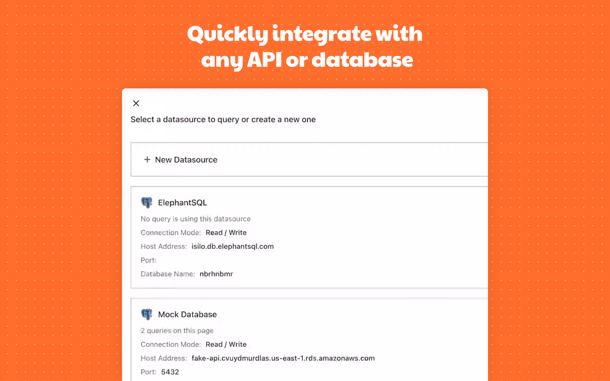

<h3 align="center">
  <b><a href="https://app.appsmith.com/signup/?utm_source=github&utm_medium=social&utm_content=website&utm_campaign=null&utm_term=website">Get Started</a></b>
  •
  <a href="https://docs.appsmith.com/?utm_source=github&utm_medium=social&utm_content=appsmith_docs&utm_campaign=null&utm_term=appsmith_docs">Docs</a>
  •
  <a href="https://community.appsmith.com/">Community</a>
  •
  <a href="https://docs.appsmith.com/tutorials">Tutorials</a>
  •
  <a href="https://app.appsmith.com/applications/602b8aef12ba0d29d3ec151c/pages/602b8aef12ba0d29d3ec151e">Events</a>
  •
  <a href="https://www.youtube.com/appsmith">Youtube</a>
  •
  <a href="https://discord.gg/rBTTVJp">Discord</a>
  •
  <a href="./appsmith_templates.md">Templates</a> 
  </h3>

Turn any datasource into an internal app in minutes. Appsmith lets you drag-and-drop UI components to build pages, connect to any API, database or GraphQL source and write logic with JavaScript objects.  
 
 

 
 

## Quick Start

The fastest way to start with Appsmith is the cloud-hosted version. When you're ready, you can also host it yourself.

- Start building apps _immediately_ with [Appsmith Cloud](https://app.appsmith.com/signup/?utm_source=github&utm_medium=social&utm_content=website&utm_campaign=null&utm_term=website) _(Recommended)_
- Install locally or on a private instance with [Docker](https://docs.appsmith.com/setup/docker?utm_source=github&utm_medium=social&utm_content=appsmith_docs&utm_campaign=null&utm_term=appsmith_docs) _(Recommended)_
- Deploy on a [Kubernetes](https://docs.appsmith.com/setup/kubernetes?utm_source=github&utm_medium=social&utm_content=appsmith_docs&utm_campaign=null&utm_term=appsmith_docs) cluster
- Deploy to [AWS with an AMI](https://docs.appsmith.com/setup/aws-ami?utm_source=github&utm_medium=social&utm_content=appsmith_docs&utm_campaign=null&utm_term=appsmith_docs) on the marketplace
- One-click deploy to [Heroku](https://docs.appsmith.com/setup/heroku?utm_source=github&utm_medium=social&utm_content=appsmith_docs&utm_campaign=null&utm_term=appsmith_docs)

 

## Features

  

Use [ready components](https://docs.appsmith.com/widget-reference/button) to build workflows in record time. Drag common elements like tables, charts, forms and more right into your app.

_Includes text, forms, inputs, buttons, tables, images, charts, checkboxes, switches, radio buttons, datepickers, dropdowns, filepickers, containers, maps, modals, rich text editors, tabs & video._  

  

Appsmith automagically works using any DB, Rest API or GraphQL as a datasource, with support for OAuth 2.0 and CURL. Here's a list of all our [pre-built integrations](https://docs.appsmith.com/core-concepts/connecting-to-data-sources/connecting-to-databases).

_Currently works with PostgreSQL, MongoDB, MySQL, Firestore, S3, Redshift, Elastic Search, DynamoDB, Redis, and MSFT SQL Server._  

  

We'll run JS anywhere! Code interactions between elements, update datasources or manipulate SQL queries—[we'll parse JS anywhere](https://docs.appsmith.com/core-concepts/writing-code). 

  

[Push a button](https://docs.appsmith.com/core-concepts/access-control) to deploy & share apps with your team, or privately invite your team using OAuth 2.0. Each member can be assigned a role with access to certain parts of the app. 

#### 🔑 Solid 256-bit Encryption

Appsmith apps are [secure by default](https://docs.appsmith.com/security). All connections are TLS-encrypted, and credentials are encrypted with AES-256—so we can't see any of your data. For added security, try our [self-hosted options](https://docs.appsmith.com/setup).  

#### 🎙 Transparent Support

Issues are inevitable. When you have one, our entire team is around to help—

- 💬 Talk to us on [Discord](https://discord.gg/rBTTVJp)
- 📄 Find a solution in our [Documentation](https://docs.appsmith.com)
- ⚠️ Open an issue right here on [GitHub](https://github.com/appsmithorg/appsmith/issues/new/choose)
- 👾 Ask for help on our [Forum](https://community.appsmith.com)
- Join our Beta users program and give us feedback <a href = "https://www.notion.so/Betasmith-Join-the-Appsmith-Beta-Community-5c288dfd57bd4c4781c3bf02ddf9aa8a">Betasmith Community</a>. Be a part of the community that will help shape the future of Appsmith.

## Deployment Options

Check out the instructions for deploying Appsmith on different services:

| **Cloud Provider** |                                                                                                                 **Link**                                                                                                                 |                                      **Documentation**                                      |
| :----------------: | :--------------------------------------------------------------------------------------------------------------------------------------------------------------------------------------------------------------------------------------: | :-----------------------------------------------------------------------------------------: |
|    DigitalOcean    |  | [Link](https://blog.appsmith.com/self-host-appsmith-in-just-a-few-minutes-on-digital-ocean) |
|      AWS AMI       |                                         |                       [Link](https://docs.appsmith.com/setup/aws-ami)                       |
|       Docker       |                                                                                                                                                                                                                                          |                       [Link](https://docs.appsmith.com/setup/docker)                        |
|     Kubernetes     |                                                                                                                                                                                                                                          |                     [Link](https://docs.appsmith.com/setup/kubernetes)                      |

## Demos

Check out some real applications that can be built with Appsmith:

- 👩‍💻 [Customer Support Dashboard](https://app.appsmith.com/applications/5f2aeb2580ca1f6faaed4e4a/pages/5f2d61b580ca1f6faaed4e79/?utm_source=github&utm_medium=direct&utm_content=appsmith_apps&utm_campaign=null&utm_term=appsmith_apps)
- 🗓️ [Calendly in Appsmith](https://app.appsmith.com/applications/600186605b452f525458d6d2/pages/600186605b452f525458d6d4/?utm_source=github&utm_medium=direct&utm_content=appsmith_apps&utm_campaign=null&utm_term=appsmith_apps)
- 💸 [Fundraising CRM](https://app.appsmith.com/applications/6098bdc65864501cc39c3d2f/pages/6098bdc65864501cc39c3d31/?utm_source=github&utm_medium=direct&utm_content=appsmith_apps&utm_campaign=null&utm_term=appsmith_apps)
- 📄 [Application Tracking System App](https://app.appsmith.com/applications/5f43bce13697fd5df1c52ce4/pages/5f43c39c3697fd5df1c52d50/?utm_source=github&utm_medium=direct&utm_content=appsmith_apps&utm_campaign=null&utm_term=appsmith_apps)

- 🌟 Made something cool? [Share it with the community](https://discord.gg/Tx395War)
    

## Tutorials

Here are the latest tutorials and videos for you to learn more about Appsmith:

1. [Build an Investor CRM using Appsmith on Google Sheets](https://www.appsmith.com/blog/build-an-investor-crm-using-appsmith-on-google-sheets)
2. [Building an Admin Panel on MongoDB using Appsmith](https://blog.appsmith.com/building-an-admin-panel-with-mongodb-using-appsmith) ([Video](https://www.youtube.com/watch?v=tisUaIgI86k))
3. [Building a Discount Management Dashboard With Postgres](https://blog.appsmith.com/building-a-discount-management-dashboard-with-postgres)
4. [Building a Customer Support Dashboard in Appsmith](https://www.youtube.com/watch?v=-O_6OLREEzo)
5. [Building a Store Catalogue Management System using Appsmith and GraphQL](https://blog.appsmith.com/building-a-store-catalogue-management-system-using-appsmith-and-graphql)
6. [Using the Notion API to Build a Content Management System](https://blog.appsmith.com/using-the-notion-api-to-build-a-content-management-system)
7. [How to run manual jobs in Gitlab CI/CD](https://blog.appsmith.com/how-to-run-manual-jobs-in-gitlab-cicd) ([Video](https://www.youtube.com/watch?v=CYdeJcD4I8A))
8. [Building a Calendly Clone in Appsmith](https://blog.appsmith.com/how-to-build-a-calendly-clone-in-30-minutes)
9. [Building Internal Tools with Appsmith](https://youtu.be/eYYYfuW-kEE) `Community`
10. [Building an Issue Tracker with Appsmith](https://dev.to/pjmantoss/how-to-build-an-issue-tracker-with-appsmith-204e) `Community`

Visit our [blog](https://blog.appsmith.com/) to explore more.

## Contribute

We love our contributors! We're committed to fostering an open and welcoming environment in the community. If you'd like to contribute anything from a bug-fix to a feature update, start here—

- 📖 Read our [Contribution Guide](https://github.com/appsmithorg/appsmith/blob/master/CONTRIBUTING.md)
- 🧩 [Set up your local environment](https://github.com/appsmithorg/appsmith/blob/master/contributions/CodeContributionsGuidelines.md#-setup-for-local-development)
- 👾 Explore some [good first issues](https://github.com/appsmithorg/appsmith/issues?q=is%3Aissue+is%3Aopen+label%3A%22Good+First+Issue%22)
- 📕 Read our [Code of Conduct](CODE_OF_CONDUCT.md)

#### Top Contributors (36)

<!-- ALL-CONTRIBUTORS-LIST:START - Do not remove / modify this section -->
<!-- prettier-ignore-start -->
<!-- markdownlint-disable -->
<table>
  <tr>
    <td align="center"><a href="http://arpitmohan.com"> <b>Arpit Mohan</b></a> <a href="https://github.com/appsmithorg/appsmith/commits?author=mohanarpit" title="Code">💻</a></td>
    <td align="center"><a href="https://github.com/Nikhil-Nandagopal"> <b>Nikhil Nandagopal</b></a> <a href="https://github.com/appsmithorg/appsmith/commits?author=Nikhil-Nandagopal" title="Documentation">📖</a> <a href="https://github.com/appsmithorg/appsmith/commits?author=Nikhil-Nandagopal" title="Code">💻</a> <a href="#projectManagement-Nikhil-Nandagopal" title="Project Management">📆</a></td>
    <td align="center"><a href="https://github.com/areyabhishek"> <b>areyabhishek</b></a> <a href="#ideas-areyabhishek" title="Ideas, Planning, & Feedback">🤔</a> <a href="#design-areyabhishek" title="Design">🎨</a></td>
    <td align="center"><a href="https://github.com/trishaanand"> <b>Trisha Anand</b></a> <a href="https://github.com/appsmithorg/appsmith/commits?author=trishaanand" title="Code">💻</a> <a href="#infra-trishaanand" title="Infrastructure (Hosting, Build-Tools, etc)">🚇</a> <a href="#ideas-trishaanand" title="Ideas, Planning, & Feedback">🤔</a></td>
    <td align="center"><a href="https://github.com/hetunandu"> <b>Hetu Nandu</b></a> <a href="https://github.com/appsmithorg/appsmith/commits?author=hetunandu" title="Code">💻</a> <a href="https://github.com/appsmithorg/appsmith/commits?author=hetunandu" title="Tests">⚠️</a> <a href="#ideas-hetunandu" title="Ideas, Planning, & Feedback">🤔</a></td>
    <td align="center"><a href="https://github.com/riodeuno"> <b>Abhinav Jha</b></a> <a href="https://github.com/appsmithorg/appsmith/commits?author=riodeuno" title="Code">💻</a></td>
    <td align="center"><a href="https://github.com/satbir121"> <b>satbir121</b></a> <a href="https://github.com/appsmithorg/appsmith/commits?author=satbir121" title="Code">💻</a> <a href="#ideas-satbir121" title="Ideas, Planning, & Feedback">🤔</a></td>
  </tr>
  <tr>
    <td align="center"><a href="https://sharats.me"> <b>Shrikant Sharat Kandula</b></a> <a href="https://github.com/appsmithorg/appsmith/commits?author=sharat87" title="Code">💻</a> <a href="#plugin-sharat87" title="Plugin/utility libraries">🔌</a></td>
    <td align="center"><a href="https://github.com/aakashDesign"> <b>Aakash Shrivastava</b></a> <a href="#design-aakashDesign" title="Design">🎨</a></td>
    <td align="center"><a href="https://github.com/Debsourabh"> <b>Debsourabh Ghosh</b></a> <a href="#design-Debsourabh" title="Design">🎨</a></td>
    <td align="center"><a href="https://github.com/NandanAnantharamu"> <b>NandanAnantharamu</b></a> <a href="https://github.com/appsmithorg/appsmith/commits?author=NandanAnantharamu" title="Tests">⚠️</a></td>
    <td align="center"><a href="https://github.com/prapullac"> <b>prapullac</b></a> <a href="https://github.com/appsmithorg/appsmith/issues?q=author%3Aprapullac" title="Bug reports">🐛</a> <a href="https://github.com/appsmithorg/appsmith/commits?author=prapullac" title="Tests">⚠️</a></td>
    <td align="center"><a href="https://github.com/Saket2"> <b>Saket Agrawal</b></a> <a href="https://github.com/appsmithorg/appsmith/issues?q=author%3ASaket2" title="Bug reports">🐛</a> <a href="https://github.com/appsmithorg/appsmith/commits?author=Saket2" title="Documentation">📖</a></td>
    <td align="center"><a href="https://harishkotra.me"> <b>Harish Kotra</b></a> <a href="https://github.com/appsmithorg/appsmith/issues?q=author%3Aharishkotra" title="Bug reports">🐛</a></td>
  </tr>
  <tr>
    <td align="center"><a href="https://github.com/visibleajay"> <b>Ajay Kumar</b></a> <a href="https://github.com/appsmithorg/appsmith/issues?q=author%3Avisibleajay" title="Bug reports">🐛</a> <a href="https://github.com/appsmithorg/appsmith/commits?author=visibleajay" title="Documentation">📖</a></td>
    <td align="center"><a href="https://github.com/akbansa"> <b>Anshul Bansal</b></a> <a href="https://github.com/appsmithorg/appsmith/issues?q=author%3Aakbansa" title="Bug reports">🐛</a> <a href="https://github.com/appsmithorg/appsmith/commits?author=akbansa" title="Code">💻</a></td>
    <td align="center"><a href="https://github.com/gogetter22"> <b>Navia Garg</b></a> <a href="https://github.com/appsmithorg/appsmith/issues?q=author%3Agogetter22" title="Bug reports">🐛</a></td>
    <td align="center"><a href="https://github.com/Xniveres"> <b>Xniveres</b></a> <a href="https://github.com/appsmithorg/appsmith/issues?q=author%3AXniveres" title="Bug reports">🐛</a></td>
    <td align="center"><a href="https://github.com/daniel-shuy"> <b>Daniel Shuy</b></a> <a href="https://github.com/appsmithorg/appsmith/commits?author=daniel-shuy" title="Code">💻</a> <a href="https://github.com/appsmithorg/appsmith/commits?author=daniel-shuy" title="Documentation">📖</a></td>
    <td align="center"><a href="http://prashantchaubey.com"> <b>Prashant Chaubey</b></a> <a href="https://github.com/appsmithorg/appsmith/commits?author=pc9795" title="Code">💻</a></td>
    <td align="center"><a href="https://github.com/A-Scratchy"> <b>Adam</b></a> <a href="https://github.com/appsmithorg/appsmith/commits?author=A-Scratchy" title="Code">💻</a></td>
  </tr>
  <tr>
    <td align="center"><a href="https://github.com/sumanthyedoti"> <b>Sumanth Yedoti</b></a> <a href="https://github.com/appsmithorg/appsmith/commits?author=sumanthyedoti" title="Code">💻</a></td>
    <td align="center"><a href="https://github.com/nidhi-nair"> <b>Nidhi</b></a> <a href="https://github.com/appsmithorg/appsmith/commits?author=nidhi-nair" title="Code">💻</a></td>
    <td align="center"><a href="https://github.com/jsartisan"> <b>Pawan Kumar</b></a> <a href="https://github.com/appsmithorg/appsmith/commits?author=jsartisan" title="Code">💻</a></td>
    <td align="center"><a href="https://github.com/sumitsum"> <b>Sumit Kumar</b></a> <a href="https://github.com/appsmithorg/appsmith/commits?author=sumitsum" title="Code">💻</a></td>
    <td align="center"><a href="https://github.com/rishabhsaxena"> <b>Rishabh Saxena </b></a> <a href="https://github.com/appsmithorg/appsmith/commits?author=rishabhsaxena" title="Code">💻</a></td>
    <td align="center"><a href="https://github.com/ofpiyush"> <b>Piyush Mishra</b></a> <a href="https://github.com/appsmithorg/appsmith/commits?author=ofpiyush" title="Code">💻</a></td>
    <td align="center"><a href="https://github.com/akash-codemonk"> <b>akash-codemonk</b></a> <a href="https://github.com/appsmithorg/appsmith/commits?author=akash-codemonk" title="Code">💻</a></td>
  </tr>
  <tr>
    <td align="center"><a href="https://github.com/vicky-primathon"> <b>vicky-primathon</b></a> <a href="https://github.com/appsmithorg/appsmith/commits?author=vicky-primathon" title="Code">💻</a></td>
    <td align="center"><a href="https://github.com/devrk96"> <b>devrk96</b></a> <a href="https://github.com/appsmithorg/appsmith/commits?author=devrk96" title="Code">💻</a></td>
    <td align="center"><a href="https://github.com/trdillon"> <b>Tim Dillon</b></a> <a href="https://github.com/appsmithorg/appsmith/commits?author=trdillon" title="Code">💻</a></td>
    <td align="center"><a href="https://github.com/zegerhoogeboom"> <b>Zeger Hoogeboom</b></a> <a href="https://github.com/appsmithorg/appsmith/commits?author=zegerhoogeboom" title="Code">💻</a></td>
    <td align="center"><a href="https://github.com/Devedunkey"> <b>Young Yoo</b></a> <a href="https://github.com/appsmithorg/appsmith/commits?author=Devedunkey" title="Code">💻</a></td>
    <td align="center"><a href="http://dwayne.io"> <b>Dwayne Forde</b></a> <a href="https://github.com/appsmithorg/appsmith/commits?author=osis" title="Code">💻</a> <a href="https://github.com/appsmithorg/appsmith/commits?author=osis" title="Tests">⚠️</a></td>
    <td align="center"><a href="https://github.com/monarch0111"> <b>Abhishek</b></a> <a href="https://github.com/appsmithorg/appsmith/commits?author=monarch0111" title="Code">💻</a></td>
  </tr>
  <tr>
    <td align="center"><a href="http://www.navdeepsingh.in/"> <b>Navdeep Singh</b></a> <a href="https://github.com/appsmithorg/appsmith/commits?author=navdeepsingh" title="Code">💻</a></td>
    <td align="center"><a href="https://github.com/aswathkk"> <b>Aswath K</b></a> <a href="https://github.com/appsmithorg/appsmith/commits?author=aswathkk" title="Code">💻</a></td>
    <td align="center"><a href="http://appsmith.com"> <b>Somangshu Goswami</b></a> <a href="https://github.com/appsmithorg/appsmith/issues?q=author%3Asomangshu" title="Bug reports">🐛</a> <a href="https://github.com/appsmithorg/appsmith/commits?author=somangshu" title="Code">💻</a></td>
    <td align="center"><a href="https://github.com/akshayrangasaid"> <b>akshayrangasaid</b></a> <a href="#content-akshayrangasaid" title="Content">🖋</a> <a href="#ideas-akshayrangasaid" title="Ideas, Planning, & Feedback">🤔</a></td>
    <td align="center"><a href="https://github.com/marks0351"> <b>Ashok Kumar M</b></a> <a href="https://github.com/appsmithorg/appsmith/commits?author=marks0351" title="Code">💻</a></td>
    <td align="center"><a href="https://www.rafaaudibert.dev"> <b>Rafael Baldasso Audibert</b></a> <a href="https://github.com/appsmithorg/appsmith/commits?author=rafaeelaudibert" title="Code">💻</a></td>
    <td align="center"><a href="https://github.com/yaldram"> <b>Arsalan Yaldram</b></a> <a href="https://github.com/appsmithorg/appsmith/commits?author=yaldram" title="Code">💻</a> <a href="#ideas-yaldram" title="Ideas, Planning, & Feedback">🤔</a></td>
  </tr>
  <tr>
    <td align="center"><a href="https://github.com/prsidhu"> <b>Preet Sidhu</b></a> <a href="https://github.com/appsmithorg/appsmith/commits?author=prsidhu" title="Code">💻</a> <a href="https://github.com/appsmithorg/appsmith/issues?q=author%3Aprsidhu" title="Bug reports">🐛</a></td>
  </tr>
</table>

<!-- markdownlint-restore -->
<!-- prettier-ignore-end -->

<!-- ALL-CONTRIBUTORS-LIST:END -->

## License

Appsmith is available under the [Apache License 2.0](https://github.com/appsmithorg/appsmith/blob/release/LICENSE). Use it wisely.
