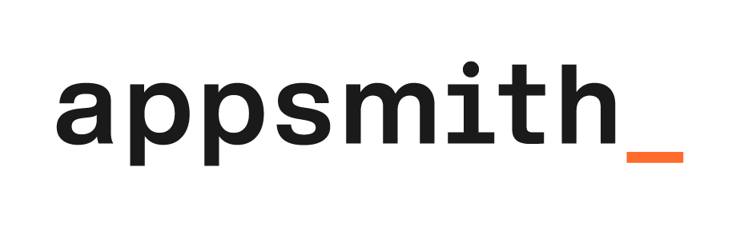

---

> 🌐 其他语言版本：[English](./README.md) | **简体中文**

各组织会构建自定义应用程序，如仪表盘、管理面板、客户360视图、IT自动化和服务管理工具，以帮助团队更高效地工作。Appsmith 是一个开源低代码平台，可简化自定义应用程序的开发、部署和维护。了解更多请访问我们的[官网](https://www.appsmith.com?utm_source=github&utm_medium=organic&utm_campaign=readme)。

## 安装

有两种方式可以开始使用 Appsmith：

- 在 [Appsmith Cloud](https://login.appsmith.com/?utm_source=github&utm_medium=organic&utm_campaign=readme) 上注册。
- 在您的机器上安装 Appsmith。请参阅以下安装指南。

| 安装方式                                                                                                                         | 文档                                                                                                                                                             |
| ------------------------------------------------------------------------------------------------------------------------------ | ---------------------------------------------------------------------------------------------------------------------------------------------------------------- |
|                   | [Docker](https://docs.appsmith.com/getting-started/setup/installation-guides/docker?utm_source=github&utm_medium=organic&utm_campaign=readme) （*推荐*）        |
|         | [Kubernetes](https://docs.appsmith.com/getting-started/setup/installation-guides/kubernetes?utm_source=github&utm_medium=organic&utm_campaign=readme) |
|                       | [AWS AMI](https://docs.appsmith.com/getting-started/setup/installation-guides/aws-ami?utm_source=github&utm_medium=organic&utm_campaign=readme)           |

如需其他部署选项，请参阅[安装指南](https://docs.appsmith.com/getting-started/setup/installation-guides?utm_source=github&utm_medium=organic&utm_campaign=readme)文档。

## 开发

要在本地开发环境中构建和运行 Appsmith，请参阅[本地开发环境搭建](https://github.com/appsmithorg/appsmith/blob/master/contributions/CodeContributionsGuidelines.md#-setup-for-local-development)。

## 学习资源

- [文档](https://docs.appsmith.com?utm_source=github&utm_medium=organic&utm_campaign=readme)
- [教程](https://docs.appsmith.com/getting-started/tutorials?utm_source=github&utm_medium=organic&utm_campaign=readme)
- [视频](https://www.youtube.com/appsmith?utm_source=github&utm_medium=organic&utm_campaign=readme)
- [模板](https://www.appsmith.com/templates?utm_source=github&utm_medium=organic&utm_campaign=readme&utm_content=support)

## 需要帮助？

- [Discord](https://discord.gg/rBTTVJp?utm_source=github&utm_medium=organic&utm_campaign=readme)
- [社区门户](https://community.appsmith.com/?utm_source=github&utm_medium=organic&utm_campaign=readme)
- [support@appsmith.com](mailto:support@appsmith.com)

## Appsmith Agents

全新推出的智能体 AI 平台，可将最新的 AI 模型与私有及专有数据大规模集成——嵌入团队日常使用的工具和系统中。Appsmith Agents 扩展了生成式 AI 的能力，服务于销售、支持、客户成功、人力资源及其他业务团队中的数百万知识工作者。通过为 AI 模型提供持续的上下文，Appsmith Agents 让团队无需模型微调或复杂的 RAG 实现，即可针对自身业务提出问题并配置自动化。访问 [appsmith.com/ai](https://www.appsmith.com/ai) 了解更多。

## 贡献

我们 ❤️ 我们的贡献者。我们致力于在社区中营造一个开放、友好和安全的环境。

📕 我们期望所有参与社区的人都遵守我们的[行为准则](https://github.com/appsmithorg/appsmith/blob/release/CODE_OF_CONDUCT.md)。请阅读并遵守。 
🤝 如果您想贡献代码，请先阅读我们的[贡献指南](https://github.com/appsmithorg/appsmith/blob/master/CONTRIBUTING.md)。 
👾 探索一些[适合新手的问题](https://github.com/appsmithorg/appsmith/issues?q=is%3Aissue+is%3Aopen+label%3A%22Good+First+Issue%22)。

让我们一起打造优秀的软件。

## 许可证

Appsmith 基于 [Apache License 2.0](https://github.com/appsmithorg/appsmith/blob/release/LICENSE) 许可证发布。
