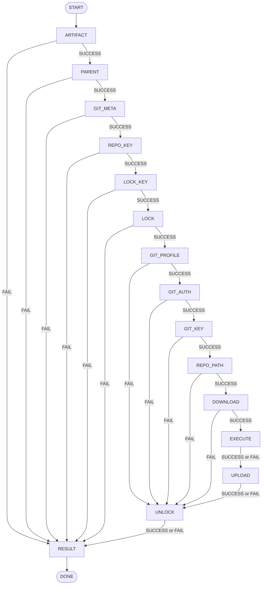

## GitRoute FSM Execution Flow

```mermaid
flowchart TD
    START([START]) --> ARTIFACT

    ARTIFACT -->|SUCCESS| PARENT
    ARTIFACT -->|FAIL| RESULT

    PARENT -->|SUCCESS| GIT_META
    PARENT -->|FAIL| RESULT

    GIT_META -->|SUCCESS| REPO_KEY
    GIT_META -->|FAIL| RESULT

    REPO_KEY -->|SUCCESS| LOCK_KEY
    REPO_KEY -->|FAIL| RESULT

    LOCK_KEY -->|SUCCESS| LOCK
    LOCK_KEY -->|FAIL| RESULT

    LOCK -->|SUCCESS| GIT_PROFILE
    LOCK -->|FAIL| RESULT

    GIT_PROFILE -->|SUCCESS| GIT_AUTH
    GIT_PROFILE -->|FAIL| UNLOCK

    GIT_AUTH -->|SUCCESS| GIT_KEY
    GIT_AUTH -->|FAIL| UNLOCK

    GIT_KEY -->|SUCCESS| REPO_PATH
    GIT_KEY -->|FAIL| UNLOCK

    REPO_PATH -->|SUCCESS| DOWNLOAD
    REPO_PATH -->|FAIL| UNLOCK

    DOWNLOAD -->|SUCCESS| EXECUTE
    DOWNLOAD -->|FAIL| UNLOCK

    EXECUTE -->|SUCCESS or FAIL| UPLOAD
    UPLOAD -->|SUCCESS or FAIL| UNLOCK
    UNLOCK -->|SUCCESS or FAIL| RESULT
    RESULT --> DONE([DONE])
```
