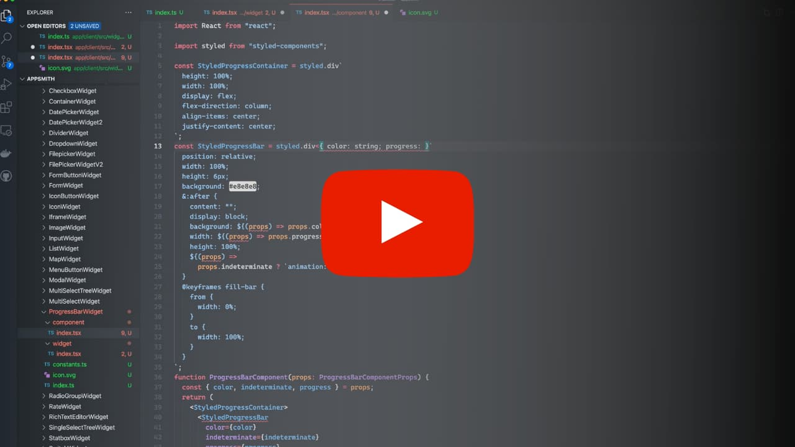
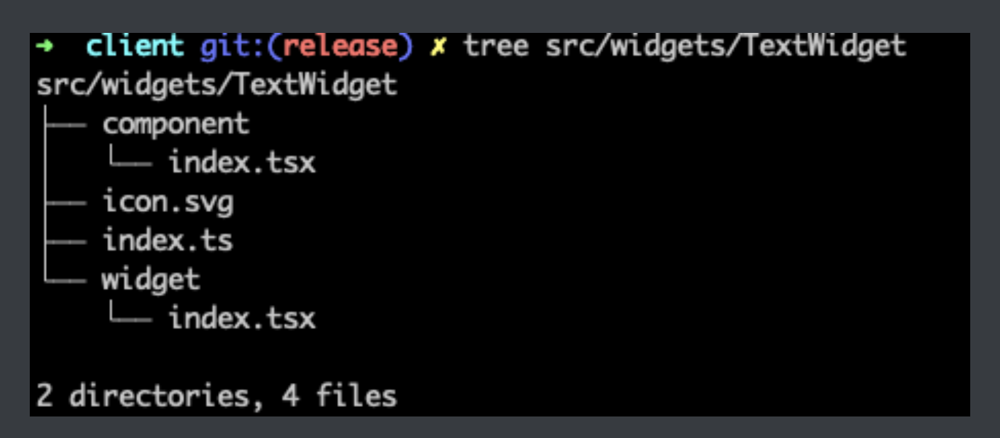
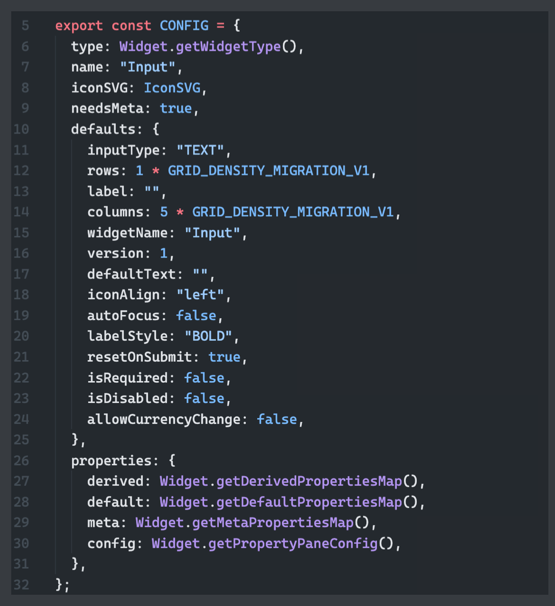
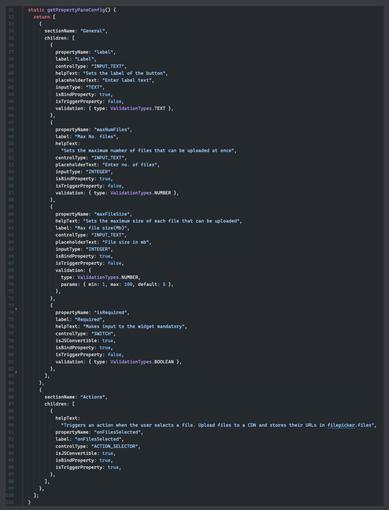

# Appsmith Widgets

[](http://www.youtube.com/watch?v=Dw3ftAn6aiw "React Component to Appsmith Widget")

React components can be connected to the Appsmith platform using the Widget Development APIs and registered to be available for use by Appsmith developers. 

- In the above video, we can view a quick walk through on the basics of the Widget Development API.
- In the following, we dive into the details of the features available to widget developers.

## Nomenclature

***Appsmith developers***: Users who use the Appsmith platform to build apps for their consumers

***Widget developers***: Developers who create widgets that are then available to the Appsmith developers to use.

***Entities***: Building blocks of an Appsmith application. These are Widgets, Queries, APIs, `appsmith.store` and JS Objects.

***Widgets***: Entities in the Appsmith Ecosystem. These are UI building blocks, similar to components in any other design system, used in Appsmith to build UI.

## Configuring a widget in Appsmith

- Appsmith developers can configure widget properties and event handlers while building an Appsmith application.
- Widget developers can decide which properties and events are exposed to Appsmith developers via the Appsmith platform.

### Widget Properties

These are the values that define the state of a Widget. If an Appsmith developer expects to update the state of Widget1 using data from other entities, they will need to `bind` the other entity as a property of Widget1.

For example, the Text Widget has a property `text`. This defines the displayed text in a Text Widget. If an Appsmith developer expects the value from an Input widget to be displayed in Text Widget, the Input widget’s text property would have to be `bound` with the Text widgets’ `text` property.

`{{ Input1.text }}`

Example

[bindings.mov](assets/bindings.mov)

Here, `Input1` is the name of the Input widget. `text` is the property of the Input widget, which contains the value we’d like to display in the Text widget. `{{ }}` allows the platform to `evaluate` the content within the brackets. This means that we can write JS code within `{{ }}` if we’d like to manipulate the entity properties. For example,

`{{ Input1.text.toLowerCase() }}`

We can read more about `bindings` [here](https://docs.appsmith.com/core-concepts/writing-code).

### Widget Action triggers

Many widgets are interactive. These widget interactions can be used to trigger workflows in web applications. This is what separates static web pages from web applications. For example, a Button widget has an interaction of click. Hence, the `onClick` action trigger is exposed, whose handler can be configured by the Appsmith developer.

As an example, let’s say we’d like to show a message at the click of a button widget. We can configure it like so: `{{ showAlert("My message", "info") }}` Here, `showAlert` is an action provided by the Appsmith platform. “My Message”, is a string that will be displayed in the alert. “info” is a `showAlert` specific parameter, which describes the type of message.

Example

[actionTriggers.mov](assets/actionTriggers.mov)

More on the platform provided action triggers can be found [here](https://docs.appsmith.com/framework-reference)

We can also, `bind` entity properties here. For example,

`{{ showAlert(Text1.text, "info") }}`

Here, `Text1.text` is the `text` property of a Text widget named `Text1`.

We can also use JS here. `{{ showAlert(Text1.text.toLowerCase(), "info") }}`

## Widget Development API

Now that we’ve seen how an Appsmith developer configures a widget, let's take a look at how a widget is developed

### Folder structure



Widget code resides in the `src/widgets` folder of the Appsmith codebase. Each widget has its own folder. As shown in the screenshot above, widget folders contain the following files and folders -

`index.ts` 

- This file contains the configuration for a widget. 

`constants.ts` 

- This file contains the constants which will be used in the widget and its components. 

`icon.svg` 

- This is the SVG file for the icon representing the widget. 

`widget/index.tsx` 

- This contains the widget code, which utilises the Widget development API and lets the Appsmith platform know how to render a widget.

`component/index.tsx` 

- This contains the core component which is rendered on the main canvas.

*Canvas*: A canvas is a special type of widget, in the Appsmith platform, within which widgets can be placed by the Appsmith developer. For example, a Container Widget contains a Canvas Widget, this allows us to place other widgets within a container widget.

[canvas.mov](assets/canvas.mov)

We can generate the folder structure using this command from the CLI -

`cd app/client && yarn generate:widget`

### Widget Registration

For a widget to be listed by the Appsmith application, it has to be registered with the Appsmith platform. This can be done by calling `registerWidget` with the details of the widget in the [`registerWidgets`](https://github.com/appsmithorg/appsmith/blob/24b9da6741660ab624c27fc9bbcca335779733cc/app/client/src/utils/WidgetRegistry.tsx#L109) function.
- `registerWidget` (required, void): Appsmith utility function used to register a widget.

Arguments:

   - `Widget` : A class which extends [`BaseWidget`](https://github.com/appsmithorg/appsmith/blob/24b9da6741660ab624c27fc9bbcca335779733cc/app/client/src/widgets/BaseWidget.tsx#L55)

   - `config` : Widget configuration (`CONFIG` described below)

### Widget configuration `index.ts`

This exports the widget configuration as an object usually named `CONFIG`. The default export has to be the widget itself. An example is shown here



### Configuration options

- `type` (required): `Widget.getWidgetType()`, where `Widget` is the default import from the `widget/index.tsx`
- `name` (required): The display name of this widget. This can contain spaces.
- `iconSVG` (required): `IconSVG`, where `IconSVG` is the import from the `./icon.svg`
- `needsMeta` (optional): `true`, if this widget stores temporary values. For example, a user input value or state.
- `isCanvas` (optional): `true`, if this widget contains a Canvas within itself, to allow for widgets to be placed within.
- `properties` (required):

```
    derived: Widget.getDerivedPropertiesMap(),
    default: Widget.getDefaultPropertiesMap(),
    meta: Widget.getMetaPropertiesMap(),
    config: Widget.getPropertyPaneConfig(),
```

- `defaults` (required): The default properties of a widget. The platform provided common configurations:

This can have the rest of the default properties for the widget. Any property not defined here will default to `undefined`. Widget developers are expected to handle these properties accordingly.
    - `rows` (required): Number of rows occupied by default by this widget when placed on a canvas.
    - `columns` (required): Number of columns occupied by default by this widget when placed on a canvas.
    - `widgetName` (required): The auto-generate widget name prefix, for this type of widget. *This cannot have spaces or special characters.*
    - `version` (required): The version number of this type of widget.
    - `blueprint` (optional): The [blueprint](#widget-blueprint) of the widget.
    - `enhancements` (optional): [Enhancements](#widget-enhancements) that can be applied over widgets.

### Points to consider:

- All configurations can affect how the widget behaves. Misconfiguration can cause errors.
- Some constants and types are provided by the Appsmith platform. These can be imported from `src/widgets/constants`. [See more](https://github.com/appsmithorg/appsmith/blob/release/app/client/src/widgets/constants.ts)
- `blueprint` and `enhancements` are powerful features that can be used to create complex widgets. We have more information [here](Link%20to%20blueprint%20and%20enhancements).

### Widget

The widget code must be all available in the `widget` folder. `index.tsx` should export the class which extends `BaseWidget`.

### Static methods:

- `getPropertyPaneConfig` (required, `[PropertyPaneConfig[]](#property-pane-configuration)`): returns the [property pane](#property-pane-configuration) configuration
- `getDerivedPropertiesMap` (optional, [DerivedPropertiesMap](#derived-properties-configuration)): returns the map of properties which can be derived from other properties. We can see more details [here](#derived-properties-configuration)
- `getDefaultPropertiesMap` (optional, object): returns the list of properties which by default takes the value of a [default property](#default-properties-configuration)
- `getMetaPropertiesMap` (optional, object): returns the properties which will be considered and stored as [meta properties](#meta-properties-configuration).
- `getWidgetType` (required, string): returns a unique type for the widget.

### Inherited methods:

- `executeAction` (void): Executes an action. Typically, used to call the configured action triggers. Arguments:
    - `triggerPayload` [ExecuteTriggerPayload](https://github.com/appsmithorg/appsmith/blob/e772fd4ff96accfb94818fa9f0b58dc6851a1cf0/app/client/src/constants/AppsmithActionConstants/ActionConstants.tsx#L24) Note: `undefined` or `null` actions throws an error.

 
- `disableDrag` (void): Prevents the widget from being dragged in the canvas. For example, the Table Widget disables widget drag when re-ordering columns using header drag. This allows for widgets to implement features without conflicting with the platform features.
    
    - `disable` Argument which disables drag when `true`, enables when `false`.
  
- `updateWidgetProperty` (void): Updates a single widget property
    - `propertyPath`: Path of the property to update
    - `propertyValue`: Value to be set
- `deleteWidgetProperty` (void): Deletes a particular widget property
- `batchUpdateProperty` (void): Updates multiple properties. Arguments:
    - `updates`: Argument type [BatchUpdatePropertyPayload](Link%20to%20type%20definition)
    - `shouldReplay` (boolean): If `false`, it will not be considered as a state to which an Appsmith developer can `undo` (`cmd+z` or `ctrl+z`). Default `true`.
- `resetChildMetaProperty` (void): Resets all meta properties of children of this widget. Arguments:
    - `widgetId`: Current `widgetId`
- `updateWidgetMetaProperty` (void): Different from `updateWidgetProperty`, these updates are not persisted across refreshes. Meta properties are transient properties, typically, user input. Arguments:
    - `propertyPath` (any, required): Property path to update
    - `propertyValue` (any, required): Value of the property.
    - `actionExecution` ([DebouncedExecuteActionPayload](https://github.com/appsmithorg/appsmith/blob/e772fd4ff96accfb94818fa9f0b58dc6851a1cf0/app/client/src/widgets/MetaHOC.tsx#L11), optional): Action if any to execute along with property update,
- `getPageView` (ReactNode, required ): Enhanced version of React.render. This should return the React component which needs to render on the canvas.

### Derived Properties Configuration

Derived properties are the ones that are computed from other properties of the widget. For example, the `isValid` property of a Rich Text Editor Widget can be computed using the `isRequired` and `text` properties. This widget’s text should be invalid if the widget is configured to require a value, and the text is empty. A simple JS conditional can help us assign a value to the `isValid` property.

`{{ this.isRequired ? this.text && this.text.length : true }}`

In this example, we have *derived* a new property from two (*isRequired*, *text*) existing properties.

Note: `this` keyword is the widget’s context. In this case, the Rich Text Editor Widget.

Using the described mechanism, `getDerivedPropertiesMap` should return an object where the keys are the derived property names, and the values are strings with JS bindings to compute the derived property value.

### Default Properties Configuration

Default properties are maps that define the default (configured in property panes) values of other properties. For example, in a Rich Text Editor Widget, the `text` property contains the user input content. However, it can also be configured to have a default starting value from the property pane. The property which is configured in the property pane is called `defaultText`. By using the `getDefaultPropertiesMap` API, widget developers can define how `text` gets its default value.

```
  static getDefaultPropertiesMap(): Record<string, string> {
    return {
      text: "defaultText",
    };
  }
```

Note: When a new value of `defaultText` is provided, it overrides the `text` value.

### Meta Properties Configuration

Meta properties are properties whose values are transient and not persisted in the application. For example, the user-provided content (*text* property) in the Rich Text Editor Widget is not persisted. However, this content is stored in memory and can be used in bindings.

We can configure these using the `getDefaultPropertiesMap` API.

```
  static getMetaPropertiesMap(): Record<string, any> {
    return {
      text: undefined,
    };
  }
```

Note: The values provided must be `undefined` if this property is also used in other APIs like `getDerivedPropertiesMap`

## Property pane configuration

Property pane configuration defines the order of property controls, their validations, grouping, types, etc.

The type is `[Array<PropertyPaneConfig>](https://github.com/appsmithorg/appsmith/blob/e772fd4ff96accfb94818fa9f0b58dc6851a1cf0/app/client/src/constants/PropertyControlConstants.tsx#L100)``.

Example:
<p>

</p>

### PropertyPaneSectionConfig

This object defines sections in the property pane. 

- `sectionName` (required, string): Display name of the section 

- `children` (required, `PropertyPaneConfig[]`): Usually, a list of property controls to show in this section. See [PropertyPaneControlConfig](#propertypanecontrolconfig) 

- `hidden` (optional, boolean): A function that defines if this section is hidden. Arguments: - `props`: The current widget properties 

- `propertyPath`: The path relative to the widget to this section. If not in a panel, this is usually the widget itself.

### PropertyPaneControlConfig

This object defines the property control’s configurations 

- `label` (required, string): Name of the property displayed to the Appsmith developer - `propertyName` (required, string): Property key with which to associate the value. 

- `helpText` (optional, string): A description to help the Appsmith developer understand the property better. Shows up in a tooltip when hovering over the label. 

- `isJSconvertible` (optional, boolean): Is the Appsmith developer allowed to use the JS button to allow bindings for this property. 

- `controlType` (required, [ControlType](https://github.com/appsmithorg/appsmith/blob/e772fd4ff96accfb94818fa9f0b58dc6851a1cf0/app/client/src/components/propertyControls/index.ts#L52)): Type of the control. 

- `panelConfig`: (optional, [PanelConfig](#panelconfig): Does this property open a panel? If so, panel configurations must be defined here. 

- `isBindProperty` (required, boolean): Can this property’s value be defined using bindings by an Appsmith developer 

- `isTriggerProperty` (required, boolean): `true` if this is an event handler that can trigger actions 

- [`updateHook`](https://github.com/appsmithorg/appsmith/blob/24b9da6741660ab624c27fc9bbcca335779733cc/app/client/src/constants/PropertyControlConstants.tsx#L49) (optional, `Array<{propertyPath: string; propertyValue: any}> | undefined`): This function is used to define any other properties which need to be updated when this property is updated. This function executes before the new property value is stored and evaluated. All property updates returned from this function will be applied simultaneously along with the original property update. 

  Arguments 

  - `props` (any): The widget’s properties. 

  - `propertyName` (string): The path to the widget property 

  - `propertyValue` (any): The new value of the property the Appsmith developer is trying to apply. - The return value should be an array of objects or `undefined`. The keys of the object are described below. 

  Return 

  - Type: `Array<{propertyPath: string; propertyValue: any}> | undefined` 

  - `propertyPath`: Path to the property which needs to be updated 

  - `propertyValue`: Value of the property which needs to be updated. 

- `hidden` (optional, boolean): A function that returns `true` if this property should be hidden. 

  Arguments: 

  - `props`: The current widget properties 

  - `propertyPath`: The path relative to the widget to this property. 

- `additionalAutoComplete` (optional, nested object): A function that returns additional entries for the autocomplete in this property. 

  Arguments: 

    - `props`: Current widget properties 

  Return 

    - Type: `Record<string, Record<string, unknown>>` 

    - This returns an object which has keywords as keys and an object as value, whose keys will be used for auto-complete. 

- `dependencies` (required for `updateHook` and `hidden`, string[]): This lists the property paths which will be needed for computations in the `hidden` and `updateHook` functions. This is an optimisation that allows for a small subset of widget properties to be used for computations. 

- `validation` (required, [ValidationConfig](#property-validation-configuration)): The configuration which defines how to validate this property.

- `customJSControl` (optional, ControlType): If we have a special control which we would like to show in place of the standard `INPUT` control.

### PanelConfig

This configuration helps in defining the details of properties shown in a panel. 
- `editableTitle` (required, boolean): It defines if the title of the panel is editable. 
- `titlePropertyName` (required, string): It defines the root path to the properties within the panel. 
- `children` (required, [PropertyPaneConfig[]](#property-pane-configuration)): It configures the sections and controls show within the panel. 
- `[updateHook](#propertypanecontrolconfig)`[Example](https://github.com/appsmithorg/appsmith/blob/e772fd4ff96accfb94818fa9f0b58dc6851a1cf0/app/client/src/widgets/TableWidget/widget/propertyConfig.ts#L305)

### Property Validation Configuration

Properties can be required to be validated when an Appsmith developer is allowed to use bindings. It helps maintain the integrity of widgets. Widget developers can expect validated properties when validations are provided.

- `type` (required, [ValidationTypes](https://github.com/appsmithorg/appsmith/blob/e772fd4ff96accfb94818fa9f0b58dc6851a1cf0/app/client/src/constants/WidgetValidation.ts#L5)): The type of validation to be performed.
- `params` (required for some validation types, [ValidationConfigParams](https://github.com/appsmithorg/appsmith/blob/e772fd4ff96accfb94818fa9f0b58dc6851a1cf0/app/client/src/constants/PropertyControlConstants.tsx#L67)): Parameters provided to help with the validation.

    - `min`(optional, number): Used to specify a minimum value for `ValidationTypes.NUMBER`
    - `max`(optional, number): Used to specify a maximum value for `ValidationTypes.NUMBER`
    - `natural`(optional, number): Used to validate a number as a natural number. Used with `ValidationTypes.NUMBER`
    - `default`(optional, unknown): Used to provide a default value to an invalid or `undefined` property value.
    - `unique`(optional, boolean | string[]): Used to specify the paths in the property which need to be unique. See [example](https://github.com/appsmithorg/appsmith/blob/e772fd4ff96accfb94818fa9f0b58dc6851a1cf0/app/client/src/widgets/DropdownWidget/widget/index.tsx#L44).
    - `required`(optional, boolean): Specifies if the value of this property, is mandatory for the widget to function correctly.
    - `regex`(optional, RegExp): Regex to match text value in `ValidationTypes.TEXT`
    - `allowedKeys`(optional, Array<Record<string, unknown>>): Array of configurations for the allowed keys in `ValidationTypes.OBJECT`.
        - `name`(required, string): Name of the key
        - `type`(required, ValidationTypes): The type of validation for the value of this key
        - `params`(optional, ValidationConfigParams): Parameters provided to help with the validation
    - `allowedValues`(optional, unknown[]): An array containing the set of allowed values for `ValidationTypes.ARRAY`
    - `children`(optional, ValidationConfig): Validation configuration for entries in `ValidationTypes.OBJECT_ARRAY`
    - `fn`(optional, `(value: unknown, props: any, _?: any, moment?: any) => ValidationResponse`): The function used to validation in `ValidationTypes.FUNCTION` 
      - *Arguments*
        - `value`(unknown): The current value of the property to validate
        - `props`(any): The properties of the current widget
        - `_`: The [lodash](https://lodash.com/docs/4.17.15) library utility
        - `moment`: The [momentjs](https://momentjs.com/docs/#/use-it/) library utility
      - Return value
        - [ValidationResponse](https://github.com/appsmithorg/appsmith/blob/e772fd4ff96accfb94818fa9f0b58dc6851a1cf0/app/client/src/constants/WidgetValidation.ts#L20): A specific format that the Appsmith platform uses to understand validation results.
            - `isValid`(required, boolean): Specifies if the property value is valid
            - `parsed`(required, unknown): The value after validation. This could be the default or the original value or a formatted version of the original value.
            - `messages`(optional, string[]): An array of messages used to describe how the validation has failed. This helps Appsmith developers identify and fix issues in property configurations
    - `expected` (required for `ValidationTypes.FUNCTION`, [CodeEditorExpected](https://github.com/appsmithorg/appsmith/blob/e772fd4ff96accfb94818fa9f0b58dc6851a1cf0/app/client/src/components/editorComponents/CodeEditor/index.tsx#L107)): A structure that describes the expected type, example and autocomplete data type.
        - `type`(required, string): The type of the property to be shown to the Appsmith developer
        - `example`(required, [ExpectedValueExample](https://github.com/appsmithorg/appsmith/blob/e772fd4ff96accfb94818fa9f0b58dc6851a1cf0/app/client/src/utils/validation/common.ts#L16)): An example of the value expected for the property.
        - `autocompleteDataType`(required, [AutocompleteDataType](https://github.com/appsmithorg/appsmith/blob/e772fd4ff96accfb94818fa9f0b58dc6851a1cf0/app/client/src/utils/autocomplete/TernServer.ts#L64)): Describes how the auto-complete feature for this property should work.
    - `strict` (optional, boolean): If set to `true`, values in `ValidationTypes.TEXT`, will not be cast to a string before validating.
    - `ignoreCase` (optional, boolean): If set to `true`, keys will be matched while ignoring case in `allowedKeys` parameter of the `ValidationTypes.OBJECT`.
    - `ValidationTypes.FUNCTION` is meant to be used sparingly, and as an escape hatch when the other `ValidationTypes` do not fit the requirements of validation.
    - All validations return a `ValidationResponse`

### Widget Blueprint

A widget blueprint is a configuration that can allow widget developers to describe the structure of widget's children and any modifications to their properties. This structure will be applied with this type of widget is placed on the canvas by an Appsmith developer.

For example, a Form Widget by default contains a canvas within which there is a text widget and button widgets. This is configured in the widget configuration [here](https://github.com/appsmithorg/appsmith/blob/24b9da6741660ab624c27fc9bbcca335779733cc/app/client/src/widgets/FormWidget/index.ts#L30)

A widget blueprint configuration can have two parts. `view` and `operations`

***Widget Blueprint View***

`view` : (optional, `Array<{ type, size, position, props }>` ) This describes the children and their structure

  - `type`  (required, WidgetType): The type of the child widget.
  - `size` (required, `{ rows: number, cols: number }`): The number of rows and columns to be occupied by the child widget.
  - `position` (required, `{ top: number, left: number }` ): The row (top) and column(left) offset of the child widget
  - `props` (optional, `Record<string, unknown>`): List of properties to be applied to the child widget as default.

*Note:* If this child needs to have its own children created at the same time, the blueprint of such a child needs to be provided as the `blueprint` property in the `props`.

*Note:* As described earlier, only the widgets of type `CANVAS_WIDGET` can have children. Therefore, in most scenarios, the blueprint configuration will start with the `CANVAS_WIDGET`, other nested children will be configured in the `blueprint` prop of the `CANVAS_WIDGET`. Please refer to the [Form Widget example](https://github.com/appsmithorg/appsmith/blob/24b9da6741660ab624c27fc9bbcca335779733cc/app/client/src/widgets/FormWidget/index.ts#L19).

*Note:* The `size` of a `CANVAS_WIDGET` need not be defined, as this type of widget works independently and occupies all of the parent's size. As a result, the `position` will also be `{top: 0, left:0}`

***Widget Blueprint Operations***

`operations`: (optional, `BlueprintOperation[]`) An array of operations to be performed to modify properties of the widget before they're shown on the canvas. 

Type of `BlueprintOperation`: 

`{ type: BlueprintOperationType, fn: BlueprintOperationFunction }`

`BlueprintOperationType`: These operations can be of three types:
   - The operations to modify properties `BlueprintOperationTypes.MODIFY_PROPS`
   - The operations to add action trigger handlers `BlueprintOperationTypes.ADD_ACTION`
   - The operations to be performed, if a child widget is added to this widget. `BlueprintOperationTypes.CHILD_OPERATIONS`

### Widget Enhancements

### Additional features

### derived.js and parseDerivedProperties.ts

- Some widgets like the Table Widget, which have complex derived properties use a separate file for the derived property functions. [`parseDerivedProperties.ts`](https://github.com/appsmithorg/appsmith/blob/release/app/client/src/widgets/ListWidget/widget/parseDerivedProperties.ts) helps load the functions from the associated [`derived.js`](https://github.com/appsmithorg/appsmith/blob/release/app/client/src/widgets/ListWidget/widget/derived.js) as strings to use in binding the derived properties.

### Component constants

- Some constants are available via the Appsmith platform for widget developers to use in building widgets, which use some standard components. [source code](https://github.com/appsmithorg/appsmith/blob/release/app/client/src/components/constants.ts)

### Widget constants

- Similar to component constants, widget constants are separate sets of constants that widget developers can utilise.
- [source1](https://github.com/appsmithorg/appsmith/blob/release/app/client/src/constants/WidgetConstants.tsx)
- [source2](https://github.com/appsmithorg/appsmith/blob/release/app/client/src/widgets/constants.ts)

### Widget Utilities

- The Appsmith platform also provides utility functions to help develop widgets. [source code](https://github.com/appsmithorg/appsmith/blob/release/app/client/src/widgets/WidgetUtils.ts)

### How are bindings evaluated?

- [A nice post](https://dev.to/appsmith/evaluating-js-in-the-browser-for-a-low-code-product-56ld) by Hetu from the Appsmith team describes the evaluation logic in detail.

### Performance considerations

- `componentDidMount` and `componentDidUpdate` lifecycle methods are discouraged when creating a widget. Other methods like `getDerivedPropertiesMap` can help derive related values before render.
- Lazy loading a widget’s component is a good idea in many scenarios, especially, if a new library is being used to create this component.