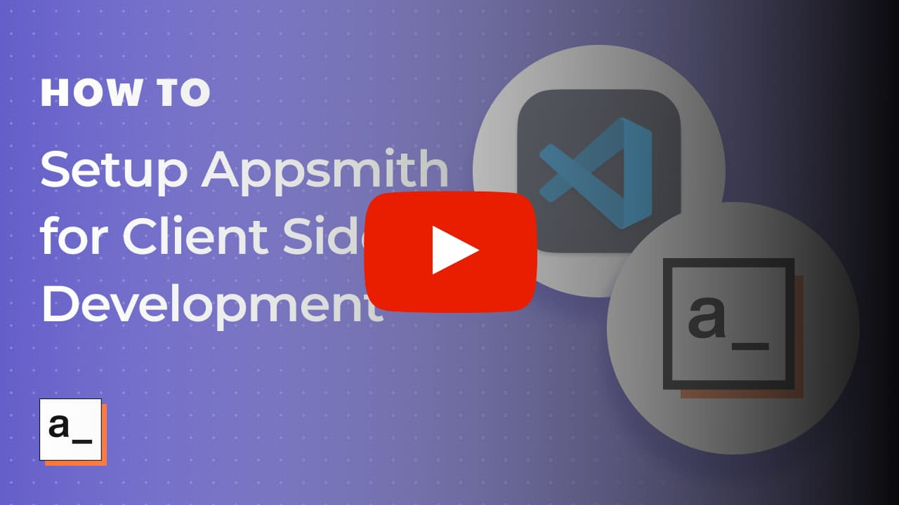
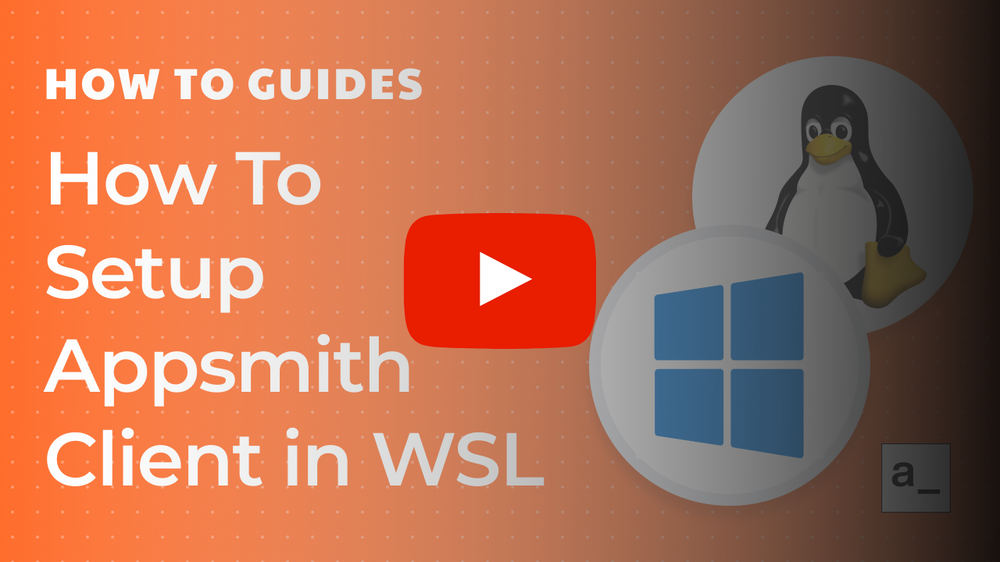

## Running Client Codebase

Appsmith's client (UI/frontend) uses the ReactJS library and Typescript. The application also uses libraries like react-redux and redux-saga for workflows. We use VS Code Editor as our primary editor.

[](https://www.youtube.com/watch?v=FwJlVWVx0X0)

### Pre-requisites:

On your development machine, please ensure that:

1. You have `docker` installed in your system. If not, please visit: [https://docs.docker.com/get-docker/](https://docs.docker.com/get-docker/)
1. You have `mkcert` installed. Please visit: [https://github.com/FiloSottile/mkcert#installation](https://github.com/FiloSottile/mkcert#installation) for details.

   - For `mkcert` to work with Firefox, you may need to install the `nss` utility. Details are in the link above.
   - On Linux, you can easily install `mkcert` using the following command

     ```
     curl -s https://api.github.com/repos/FiloSottile/mkcert/releases/latest \
     | grep "browser_download_url.*linux-amd64" \
     | cut -d : -f 2,3 | tr -d \" \
     | wget -i - -O mkcert
     chmod +x  mkcert
     sudo mv mkcert /usr/local/bin
     ```

1. You have `envsubst` installed. Use `brew install gettext` on MacOS. Linux machines usually have this installed.
1. You have cloned the repo in your local machine.
1. You have yarn installed as a global npm package, i.e. `npm install -g yarn`.
1. <b>Create local HTTPS certificates</b>

   1. Run the following command from the project root.

      ```bash
      cd app/client/docker && mkcert -install && mkcert "*.appsmith.com" && cd ../../..
      ```

      This command will create 2 files in the `docker/` directory:

      - `_wildcard.appsmith.com-key.pem`
      - `_wildcard.appsmith.com.pem`

   1. Add the domain `dev.appsmith.com` to `/etc/hosts`.

      ```bash
      echo "127.0.0.1 dev.appsmith.com" | sudo tee -a /etc/hosts
      ```

      Note:

      - Please be careful when copying the above string as space between the IP and the string goes missing sometimes.
      - Please check that the string is copied properly

        ```
        cat /etc/hosts | grep appsmith
        ```

1. Run cmd: `cp .env.example .env`
1. Run Backend server

   - The backend server can be run in two ways
     1. Use Appsmith's staging server hosted at `https://release.app.appsmith.com` for development purposes. <b>(Recommended)</b>
     1. Run the backend server locally. To setup the backend server locally, refer [here](#running-backend-locally).
   - Run the script `start-https.sh` to start the nginx container that will proxy the frontend requests to the backend server.

     - Pass the server name as an argument to this command to use that server as backend.

       ```bash
       cd app/client
       ./start-https.sh https://release.app.appsmith.com // uses Appsmith's staging backend server as backend for your local frontend code
       ```

     - If you want to use the backend server running on your local, you do not need to pass a parameter when running `start-https.sh`.

### Steps to build & run the code:

1. Run `yarn install`.

   Note:

   - On the Ubuntu Linux platform, please run the following cmd before step 2 below:

     ```
     echo fs.inotify.max_user_watches=524288 | sudo tee -a /etc/sysctl.conf && sudo sysctl -p
     ```

1. Run `yarn start`.

   - 🎉 Your Appsmith client is now running on https://dev.appsmith.com.
   - <b>This URL must be opened with https and not have port 3000 in it.</b>

1. If yarn start throws mismatch node version error

   - This error occurs because the node version is not compatible with the app environment. In this case, Node version manager can be used, allowing multiple node versions in different projects.
   - Check below for installation and usage details:

     1. Install a node version manager. For eg: check [nvm](https://github.com/nvm-sh/nvm) or [fnm](https://github.com/Schniz/fnm).
     1. In the project's root, run `nvm use 18.17.1` or `fnm use 18.17.1`.

### Running Tests on Client

#### Integration Tests

##### Pre-flight checks

- The base URL can be updated on a temporary basis in the `cypress.config.ts` file based on the configuration you used for running the codebase locally. By default, it’s `https://dev.appsmith.com` .
- If you wish to run Git test cases locally, please add `APPSMITH_GIT_ROOT=./container-volumes/git-storage` to the folder `app/server/.env` and run the server locally instead of via Docker container.

##### Setup Cypress configurations

To setup the configurations for running integration tests via Cypress, use these commands below,

```bash
  cd app/client/cypress/scripts
  yarn install
  yarn run setup
```

**Prompt:**  
 `Do you wish to continue without setting up the local server with docker? (yes/no):`

**Options:**
- **`no`:** Selecting "no" will trigger the setup of a local server using Docker with the `appsmith-ce:release` image.
- **`yes`:** Selecting "yes" will skip the local server setup process.


**Prompt:**  
 `https://dev.appsmith.com is not accessible. Do you wish to continue without setting it up?  (yes/no):`

**Options:**
- **`no`:**  Simply close the process.
- **`yes`:** Continue on the process for next stage

**Prompt:**  
 `TED (TestEventDriver) is not running. Do you want to pull & run the latest Docker container for TED (TestEventDriver)?  (yes/no):`

**Options:**
- **`no`:**  It will not create TED setup in local machine.
- **`yes`:** Download the TED image and run the image for test purposes.

##### Running Cypress tests locally

To run a specific test file in headless fashion, use the following command:

```bash
  cd app/client/
  yarn install
  npx cypress run --spec <spec path> --browser chrome
```

To open Cypress in the browser and run the tests visually

```bash
  cd app/client/
  yarn install
  npx cypress open
```

- <b><a name="running-backend-locally">Running appsmith backend server locally</a></b>

  - There are two configurations available for running the backend server locally.

    1.  Running the server from source code.
        - Refer to [documentation](https://github.com/appsmithorg/appsmith/blob/release/contributions/ServerSetup.md) for setting up backend to do this.
    1.  Running the server from a docker image. There are two ways to get a backend docker image

        1. Pull latest release branch docker image from Appsmith's public docker hub account.

           ```
           docker rm appsmith;

           cd ~/appsmith;

           rm -rf stacks;

           docker pull appsmith/appsmith-ce

           docker run -d --name appsmith -p 8000:80 appsmith/appsmith-ce:latest;

           docker logs -f appsmith;

           ./start-https.sh http://localhost:8000 // if nginx is installed locally
           ./start-https.sh http://host.docker.internal:8000 // if nginx is running on docker

           ```

        1. Create docker image from local source code

           ```
           cd ~/appsmith
           ./scripts/local_testing.sh -l # This builds a fat docker image of local backend and frontend
           # The docker image created above will show up in your docker desktop application

           docker run -d --name appsmith -p 8000:80 appsmith/appsmith-ce:local-testing;

           ./start-https.sh http://localhost:8000 // if nginx is installed locally
           ./start-https.sh http://host.docker.internal:8000 // if nginx is running on docker

           ```

- Please check out our [Testing Contribution](docs/TestAutomation.md) guide for more details on setting up & troubleshooting Cypress runs on your machine.

### Running Unit Tests

- To run the Jest unit tests, run:

  ```bash
    cd app/client
    yarn run test:unit
  ```

- To run a single jest test,

  ```bash
    cd app/client

    # Run either command below to run a test
    npx jest <file_path/file_name>

    # or

    yarn jest src/widgets/<filepath>/<filename>.test.ts --silent=false
  ```

- To run a single jest test in watch mode,
  ```bash
    npx jest --watch <file_path/file_name>
  ```

### Windows WSL2 Setup

[](https://youtu.be/Od-qic69syA)

Before you follow the instructions above, make sure to check the following steps:

1. You have **WSL2** setup in your machine. If not, please visit: [https://docs.microsoft.com/en-us/windows/wsl/install-win10](https://docs.microsoft.com/en-us/windows/wsl/install-win10).
2. You have [Node.js](https://www.geeksforgeeks.org/installation-of-node-js-on-linux/) installed on the WSL Distro.
3. You have **Docker Desktop** installed with the WSL2 backend. If not, please visit: [https://docs.docker.com/docker-for-windows/wsl/](https://docs.docker.com/docker-for-windows/wsl/).

In the above [Docker Desktop Setup](https://docs.docker.com/docker-for-windows/wsl/) instructions, make sure to:

1. Set WSL Distro to run in WSL2 mode.
2. Enable integration with the WSL Distro in Docker Desktop.
3. Install [Remote-WSL](https://marketplace.visualstudio.com/items?itemName=ms-vscode-remote.remote-wsl) extension in VSCode.

Make sure to Clone the Repo in the WSL file system instead of the Windows file system.

And finally, you can open the folder in VSCode with WSL by following the instructions in [Docker Desktop Setup](https://docs.docker.com/docker-for-windows/wsl/),
or by,

1. Clicking on the Green button on the Bottom Left corner in VSCode.
2. Selecting **Open Folder in WSL** and navigating to the folder in WSL.

After this, you can continue Setting up from [here](#pre-requisites).

### Troubleshooting

#### I am on WSL and can't reach dev.appsmith.com

- You will need to add `dev.appsmith.com` to Windows' `C:\Windows\System32\drivers\etc\hosts` instead of `/etc/hosts`. Alternately, you can install a desktop environment in WSL to open `dev.appsmith.com` from a browser in WSL.

  ```
  127.0.0.1 dev.appsmith.com
  ```

- WSL network with windows can be brittle; make sure you can reach http://127.0.0.1:3000 from windows. If not, restarting wsl usually resolves the issue.

#### Docker container doesn't work

- You can check logs with `docker logs wildcard-nginx`.
- If you see `Address already in use` errors, look for the service running on port 80 and 443 with `lsof -i tcp:80,443 | grep LISTEN` and stop the process.

  **Example**: Some Linux distros have `apache2` listening on 80. Stop them with `sudo systemctl stop apache2`

#### I want to add dev.appsmith.com conf to my local Nginx without Docker.

1. Copy `app/client/docker/templates/nginx-app.conf.template` over to your nginx sites directory.
1. You can remove or replace values for all the `sub_filter`. None of those properties are required.
1. Change `proxy_pass` value for client from `__APPSMITH_CLIENT_PROXY_PASS__` to `http://localhost:3000`
1. Replace all occurrences of `__APPSMITH_SERVER_PROXY_PASS__` with `http://localhost:8080` (or the server you want to point to)
1. Generate the certificates manually via `mkcert`.
1. Change the value of the certificate location for keys `ssl_certificate` & `ssl_certificate_key` to the place where these certificates were generated.
1. Reload nginx! :tada:

## I still need help!

Please open a [Github issue](https://github.com/appsmithorg/appsmith/issues/new/choose) or join our [discord server](https://discord.com/invite/rBTTVJp).
