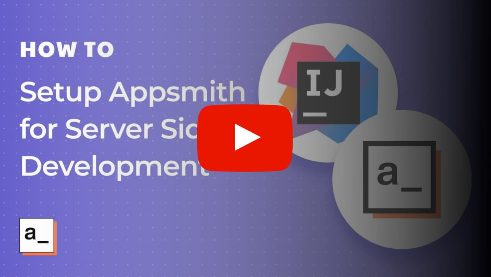

# Running Server Codebase

The server codebase is written in Java and is powered by Spring + WebFlux. This document explains how you can setup a development environment to make changes and test your changes.


[](https://www.youtube.com/watch?v=W2qbuUYGrQs)


# Setup with Docker 

You can run the server codebase in a docker container. This is the easiest way to get the server up and running if you are more interested in contributing to the client codebase.

## What's in the box

* Appsmith server
* MongoDB database
* Redis instance

## Pre-requisites

* [Docker](https://docs.docker.com/get-docker/)

## Steps for setup

1. Clone the Appsmith repository and `cd` into it
```
git clone https://github.com/appsmithorg/appsmith.git
cd appsmith
```
2. Change your directory to `app/server`
```
cd app/server
```
3. Create a copy of the `envs/docker.env.example`
```
cp envs/docker.env.example envs/docker.env
```
4. Start up the containers
```
docker-compose up -d
``` 
5. Have fun!


# Local Setup

## Pre-requisites

- Java --- OpenJDK 11.
- Maven --- version 3+ (preferably 3.6).
- A MongoDB database --- A simple way to get this up is explained [further down in this document](#setting-up-a-local-mongodb).
- A Redis instance --- A simple way to get this up is explained [further down in this document](#setting-up-a-local-redis).
- An IDE --- We use IntelliJ IDEA as our primary IDE for backend development.

## Steps for Setup

1. After cloning the repository, change your directory to `app/server`

2. Run the command  

```sh
mvn clean compile
```  
  
This generates a bunch of classes required by IntelliJ for compiling the rest of the source code. Without this step, your IDE may complain about missing classes and will be unable to compile the code.

3. Create a copy of the `envs/dev.env.example` 

```sh
cp envs/dev.env.example .env
```

This command creates a `.env` file in the `app/server` folder. All run scripts pick up environment configuration from this file.

4. Modify the property values in the file `.env` to point to your local running instance of MongoDB and Redis.

5. In order to create the final JAR for the Appsmith server, run the command:

```
./build.sh
```
This command will create a `dist` folder which contains the final packaged jar along with multiple jars for the binaries for plugins as well.

Note:
- If you want to skip tests, you can pass `-DskipTests` flag to the build cmd.
- On Ubuntu Linux environment docker needs root privilege, hence ./build.sh script needs to be run with root privilege as well.
- On Ubuntu Linux environment, the script may not be able to read .env file, so it is advised that you run the cmd like:
```
sudo APPSMITH_MONGODB_URI="mongodb://localhost:27017/appsmith" APPSMITH_REDIS_URL="redis://127.0.0.1:6379" APPSMITH_MAIL_ENABLED=false APPSMITH_ENCRYPTION_PASSWORD=abcd APPSMITH_ENCRYPTION_SALT=abcd ./build.sh
```
- If the volume containing docker's data root path (macOS: `~/Library/Containers/com.docker.docker/Data/vms/0/`, Ubuntu: `/var/lib/docker/`) has less than 2 GB of free space, then the script may fail with the following error: 
```
Check failed: Docker environment should have more than 2GB free disk space.
```
There are two ways to resolve this issue: (1) free up more space (2) change docker's data root path.


6. Start the Java server by running

```
./scripts/start-dev-server.sh
```

By default, the server will start on port 8080.

7. When the server starts, it automatically runs migrations on MongoDB and will populate it with some initial required data.

8. You can check the status of the server by hitting the endpoint: [http://localhost:8080](http://localhost:8080) on your browser. By default you should see an HTTP 401 error.

## Setting up a local MongoDB

The following command can bring up a MongoDB docker instance locally.

```sh
docker run -p 127.0.0.1:27017:27017 --name appsmith-mongodb -e MONGO_INITDB_DATABASE=appsmith -v /path/to/store/data:/data/db mongo
```

Please change the `/path/to/store/data` to a valid path on your system. This is where MongoDB will persist it's data across runs of this container.

Note that this command doesn't set any username or password on the database so we make it accessible only from localhost using the `127.0.0.1:` part in the port mapping argument. Please refer to the documentation of this image to learn [how to set a username and password](https://hub.docker.com/_/mongo).

When using this command, the value of `APPSMITH_MONGODB_URI` should be set to `mongodb://localhost:27017/appsmith` (which is what's provided in the example env file).

## Setting up a local Redis

The following command can bring up a Redis docker instance locally.

```sh
docker run -p 127.0.0.1:6379:6379 --name appsmith-redis redis
```

When using this command, the value of `APPSMITH_REDIS_URI` should be set to `redis://localhost:6379`.

## Seting up IntelliJ IDE

To run the project from within the IDE, you will need to make use of the run configuration that is part of the repository. The run configuration uses the [EnvFile](https://plugins.jetbrains.com/plugin/7861-envfile) plugin to include environment variables in the path. Any and all tests can be run within the IDE by cloning this run configuration.

1. Install the plugin EnvFile from https://plugins.jetbrains.com/plugin/7861-envfile. This is required to load the environment configurations when the server starts. 
2. Configure the Run/Debug configuration as shown in the screenshot below:


For being able to run or debug plugins, two are especially important:

- VM Options: `-Dpf4j.mode=development -Dpf4j.pluginsDir=appsmith-plugins` .
- Working Directory: The folder that contains `appsmith-server`, `appsmith-plugins` etc.

Please note when setting **Working directory** option. If the path is not correct, plugins will fail to load and cannot fetch data from mongo, redis

3. Load your env file by going to the EnvFile Tab in the Run/Debug configuration settings for your server.


## Need Assistance
- If you are unable to resolve any issue while doing the setup, please feel free to ask questions on our [Discord channel](https://discord.com/invite/rBTTVJp) or initiate a [Github discussion](https://github.com/appsmithorg/appsmith/discussions) or send an email to `support@appsmith.com`. We'll be happy to help you. 
- In case you notice any discrepancy, please raise an issue on Github and/or send an email to support@appsmith.com.
