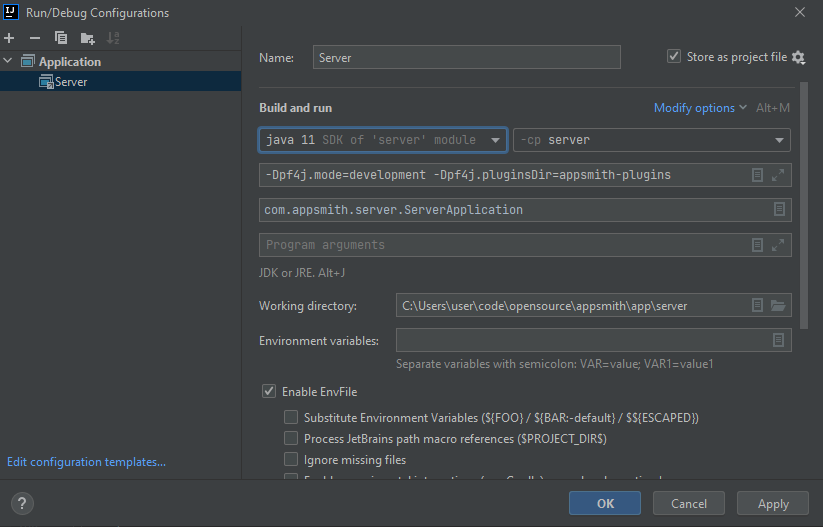
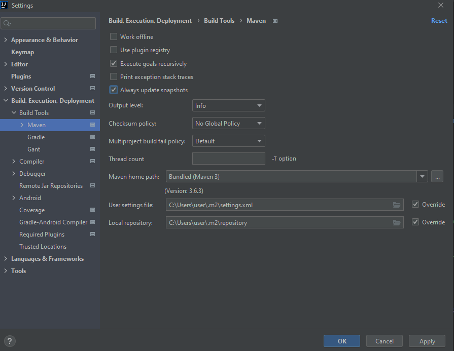

# Running Server Codebase

This document explains how you can setup a development environment for Appsmith server. As the server codebase is written in Java and is powered by Spring + WebFlux we need Java and Maven installed to build the code. In addition we also need one instance of MongoDB and Redis each to run Appsmith server. Lastly, we will set up IntelliJ IDEA to let you edit the code. Let's get those prerequisites installed on your machine.


[](https://www.youtube.com/watch?v=W2qbuUYGrQs)


# Setup with Docker 

You can run the server codebase in a docker container. This is the easiest way to get the server up and running if you are more interested in contributing to the client codebase.

## What's in the box

* Appsmith server
* MongoDB database
* Redis instance

## Pre-requisites

* [Docker](https://docs.docker.com/get-docker/)

## Steps for setup

1. Clone the Appsmith repository and `cd` into it
```console
git clone https://github.com/appsmithorg/appsmith.git
cd appsmith
```
2. Change your directory to `app/server`
```console
cd app/server
```
3. Create a copy of the `envs/docker.env.example`
```console
cp envs/docker.env.example envs/docker.env
```
4. Start up the containers
```console
docker-compose up -d
``` 
5. Have fun!


# Local Setup

## Pre-requisites

Before you can start to hack on the Appsmith server, your machine should have the following installed:

- Java - OpenJDK 11.
- Maven - Version 3+ (preferably 3.6).
- A MongoDB database - Refer to the [Setting up a local MongoDB instance](#setting-up-a-local-mongodb-instance) section to setup a MongoDB instance using `Docker`.
- A Redis instance - Refer to the [Setting up a local Redis instance](#setting-up-a-local-redis-instance) section to setup a Redis instance using `Docker`.
- An IDE - We use IntelliJ IDEA as our primary IDE for backend development. To set it up, refer to the [Setting up IntelliJ IDEA](#setting-up-intellij-idea) section.

This document doesn't provide instructions to install Java and Maven because these vary between different operating systems and distributions. Please refer to the documentation of your operating system or package manager to install these. Next we will setup MongoDB and Redis using `Docker`.

### Setting up a local MongoDB instance

The following command will start a MongoDB docker instance locally:

```console
docker run -p 127.0.0.1:27017:27017 --name appsmith-mongodb -e MONGO_INITDB_DATABASE=appsmith -v /path/to/store/data:/data/db mongo
```

Please change the `/path/to/store/data` to a valid path on your system. This is where MongoDB will persist it's data across runs of this container.

Note that this command doesn't set any username or password on the database so we make it accessible only from localhost using the `127.0.0.1:` part in the port mapping argument. Please refer to the documentation of this image to learn [how to set a username and password](https://hub.docker.com/_/mongo).

MongoDB will now be running on `mongodb://localhost:27017/appsmith`.

### Setting up a local Redis instance

The following command will start a Redis docker instance locally:

```console
docker run -p 127.0.0.1:6379:6379 --name appsmith-redis redis
```

Redis will now be running on `redis://localhost:6379`.

With the prerequisites met, let's build the code.

## Building and running the code

1. Clone Appsmith repository.
2. Change your directory to `app/server`.
3. Run the following command: 

```console
mvn clean compile
```  

This generates a bunch of classes required by IntelliJ for compiling the rest of the source code. Without this step, your IDE may complain about missing classes and will be unable to compile the code.

4. Create a copy of the `envs/dev.env.example` 

```console
cp envs/dev.env.example .env
```

This command creates a `.env` file in the `app/server` folder. All run scripts pick up environment configuration from this file.

5. Ensure that the environment variables `APPSMITH_MONGODB_URI` and `APPSMITH_REDIS_URI` in the file `.env` point to your local running instances of MongoDB and Redis.

6. Run the following command to create the final JAR for the Appsmith server:

```console
./build.sh
```
This command will create a `dist` folder which contains the final packaged jar along with multiple jars for plugins as well.

Note:
- If you want to skip tests, you can pass `-DskipTests` flag to the build cmd.
- On Ubuntu Linux environment docker needs root privilege, hence ./build.sh script needs to be run with root privilege as well.
- On Ubuntu Linux environment, the script may not be able to read .env file, so it is advised that you run the cmd like:
```console
sudo APPSMITH_MONGODB_URI="mongodb://localhost:27017/appsmith" APPSMITH_REDIS_URL="redis://127.0.0.1:6379" APPSMITH_MAIL_ENABLED=false APPSMITH_ENCRYPTION_PASSWORD=abcd APPSMITH_ENCRYPTION_SALT=abcd ./build.sh
```
- If the volume containing docker's data root path (macOS: `~/Library/Containers/com.docker.docker/Data/vms/0/`, Ubuntu: `/var/lib/docker/`) has less than 2 GB of free space, then the script may fail with the following error: 
```console
Check failed: Docker environment should have more than 2GB free disk space.
```
There are two ways to resolve this issue: (1) free up more space (2) change docker's data root path.


7. Start the Java server by running

```console
./scripts/start-dev-server.sh
```

By default, the server will start on port 8080.

8. When the server starts, it automatically runs migrations on MongoDB and will populate it with some initial required data.

9. You can check the status of the server by hitting the endpoint: [http://localhost:8080](http://localhost:8080) on your browser. By default you should see an HTTP 401 error.

Now the last bit, let's get your Intellij IDEA up and running.

## Setting up IntelliJ IDEA

To run the project from within the IDE, you will need to make use of the run configuration that is part of the repository. The run configuration uses the [EnvFile](https://plugins.jetbrains.com/plugin/7861-envfile) plugin to include environment variables in the path. Any and all tests can be run within the IDE by cloning this run configuration.

1. Install the plugin EnvFile from https://plugins.jetbrains.com/plugin/7861-envfile. This is required to load the environment configurations when the server starts. 
2. Configure the Run/Debug configuration as shown in the screenshot below:


For being able to run or debug plugins, two are especially important:

- VM Options: `-Dpf4j.mode=development -Dpf4j.pluginsDir=appsmith-plugins` .
- Working Directory: The folder that contains `appsmith-server`, `appsmith-plugins` etc.

Please note when setting **Working directory** option. If the path is not correct, plugins will fail to load and cannot fetch data from mongo, redis

3. Load your env file by going to the EnvFile Tab in the Run/Debug configuration settings for your server.


## Configuration settings for version 2021.1.2 (Community Edition) IntelliJ IDEA

After configuring settings as mentioned above, please also add the following to your IntelliJ IDEA setup.

1.  [Optional] As shown in the image below, please enable the **Store as Project** checkbox to run the application from the main class specified. 


2. Please enable the **Always update snapshots** checkbox so that the most recent build is picked up. 
 

Happy hacking ✌️

#### Note:
In case the server doesn't work with the above config, please try re-compiling the code using the steps

```console
mvn -B clean compile && ./build.sh -DskipTests
```
## Running Tests on Server

1. Ensure that you have Redis running on your local system.

2. Run the command to execute tests
```console
  cd app/server
  mvn clean package
```


## Need Assistance
- If you are unable to resolve any issue while doing the setup, please feel free to ask questions on our [Discord channel](https://discord.com/invite/rBTTVJp) or initiate a [Github discussion](https://github.com/appsmithorg/appsmith/discussions) or send an email to `support@appsmith.com`. We'll be happy to help you. 
- In case you notice any discrepancy, please raise an issue on Github and/or send an email to support@appsmith.com.
