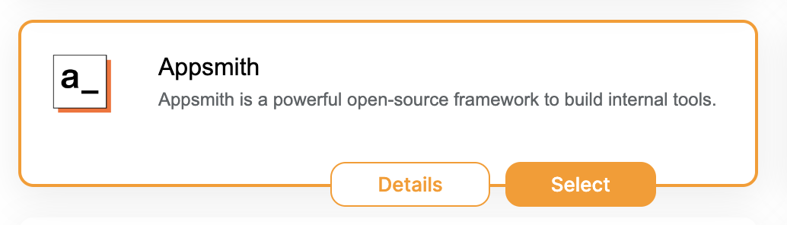
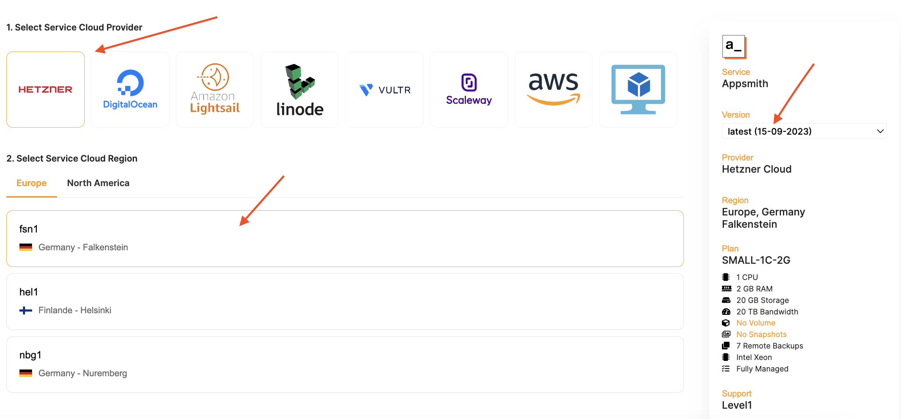
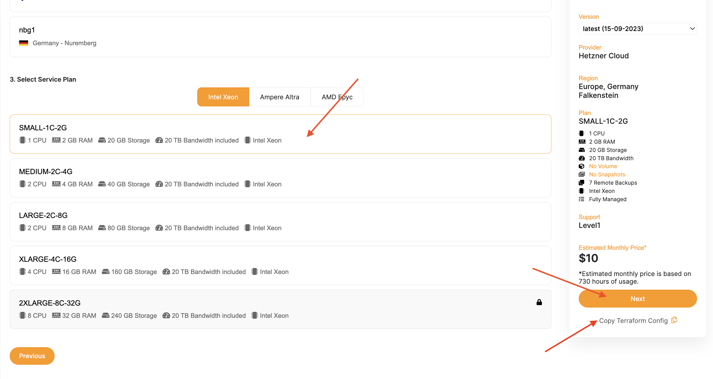
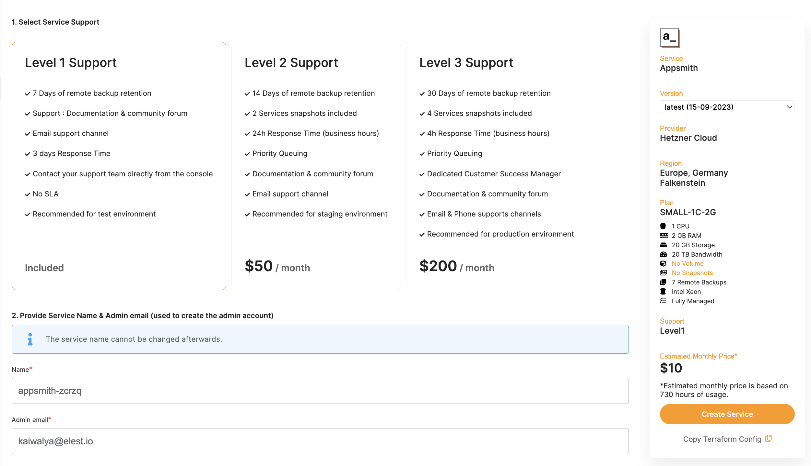
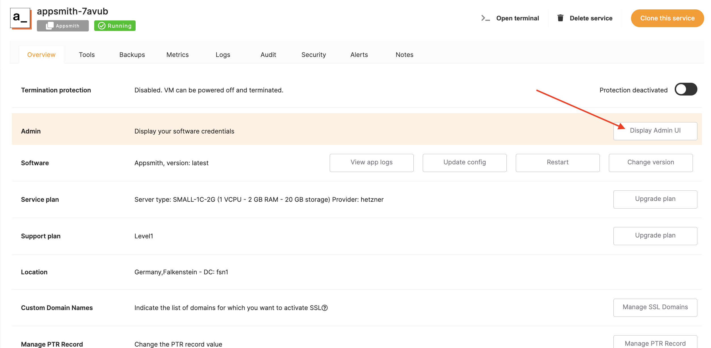
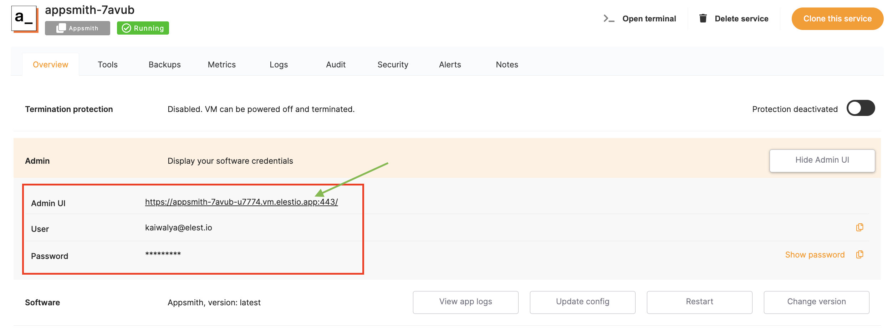
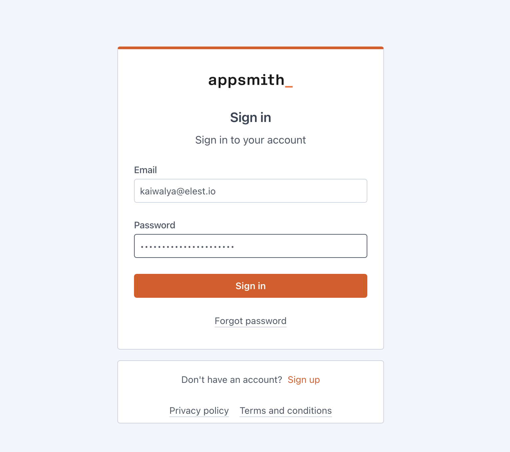
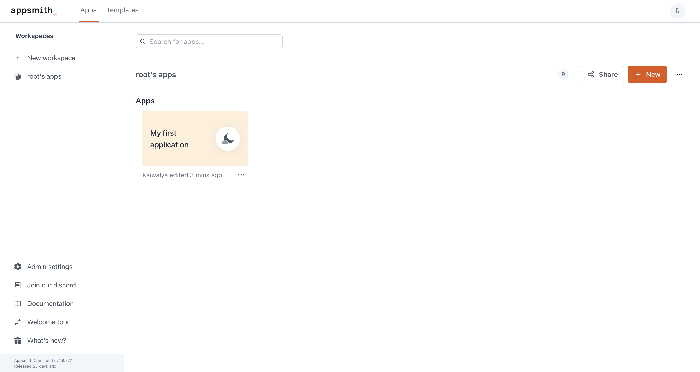
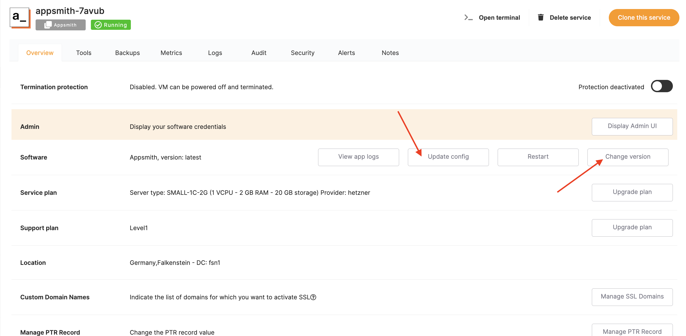
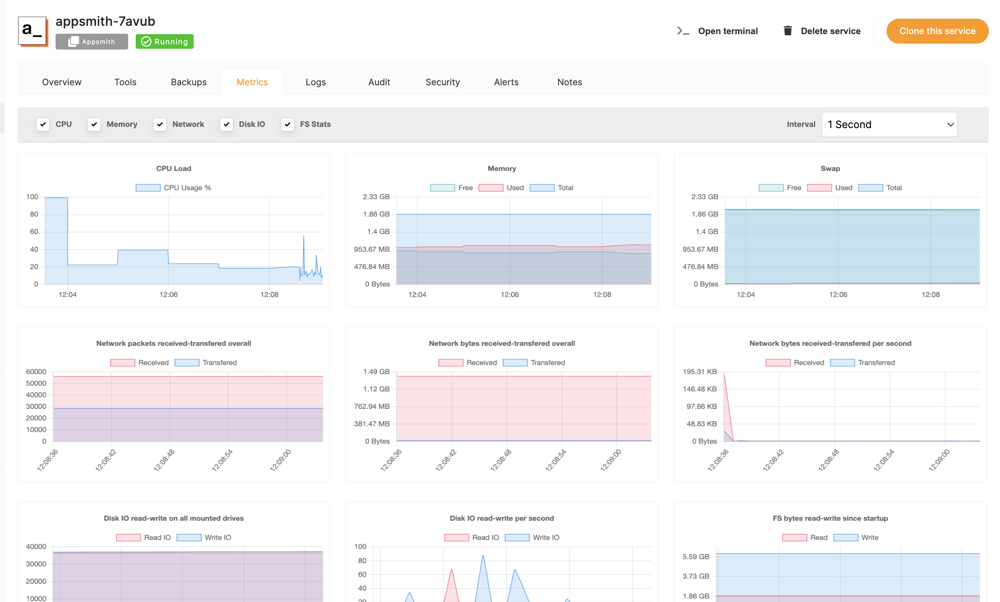

## Deploy Appsmith using Elestio

Now One-click deploy Appsmith on fully managed Elestio, easy and fast!

## Setting up Appsmith

- Signup up for an account on [Elestio](https://dash.elest.io/signup)
- Click on this button

    
- Click select on the highlighted Appsmith option

    
- Now select your favourite cloud providers and region you want your application to be hosted on. You can also change the Appsmith version to your choice as shown below

    
- Upon scrolling down you will find option to choose the type of machine you want to host Appsmith on. You can also choose to get copy of the terraform config alongside, once selected hit next

    
- Now select support level and a cool name for your Appsmith instance and hit "Create Service"

    
- Congrats, grab a coffee until it's deployed

## Using Appsmith

- Once you click on the your application under service section you will see dashboard. Click on the "Display Admin UI" option as shown in the image.

    
- Here you will find all the credentials you need to get started with using Appsmith right away.

    
- Click on the link as above and you will be redirected to the appsmith login page. Here you can add the email and password provided from Admin UI

    
- Done! Yes it's that easy to use Appsmith

    

## Reconfiguring the specifications

- You can easily reconfigure your Appsmith service according your requirements. To see that, head over to the main service dashboard and checkout the features like shown below

    

## Metrics, Logging, Auditing and much more!
- With addition to simplicity of configuring and deployment, you can make use of the full fledged monitoring, logging and auditing features.

    
- Similar to this, you can create alerts, check logs and keep track of audits of Appsmith in single dashboard. You can checkout all these features from the navbar
    
    