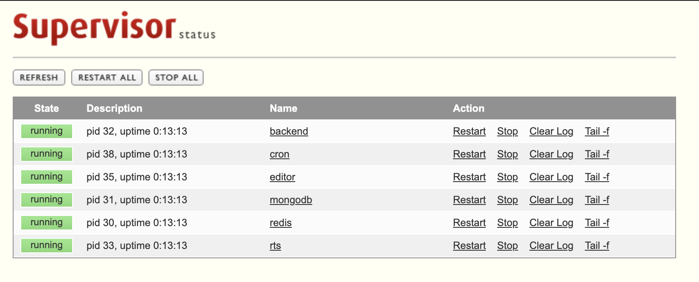

# I. Getting started
You can begin using appsmith via our cloud instance or by deploying appsmith yourself

* [Using Appsmith Cloud](quick-start.md#appsmith-cloud) **\(recommended\):** Create a new application with just one click
* [Using Docker](quick-start.md#docker): Deploy anywhere using docker

## Appsmith Cloud

The fastest way to get started with appsmith is using our cloud-hosted version. It's as easy as

1. [Create an Account](https://app.appsmith.com/user/signup)
2. [Start Building](core-concepts/building-the-ui/)

# II. Setup Appsmith use fat container
## 1. Prerequisites
- Ensure `docker` and `docker-compose` is installed and currently running:
	- Install Docker: [https://docs.docker.com/engine/install/](https://docs.docker.com/engine/install/)
	- Install Docker Compose: [https://docs.docker.com/compose/install/](https://docs.docker.com/compose/install/)
## 2. Step to setup
- 1. Create `docker-compose.yaml` and copy the following content into it
```
version: "3"
services:
  appsmith:
    image: appsmith_fat
    container_name: appsmith_fat
    ports:
      - "80:80"
      - "443:443"
      - "9001:9001"
    volumes: 
      - ./stacks/data:/opt/appsmith/data
      - ./stacks/configuration:/opt/appsmith/configuration
      - ./stacks/letsencrypt:/etc/letsencrypt
    networks:
      - appsmith
  auto_update:
    image: containrrr/watchtower
    volumes:
      - /var/run/docker.sock:/var/run/docker.sock
    # Update check interval in seconds.
    command: --interval 300 --label-enable --cleanup
    networks:
      - appsmith
networks:
  appsmith:
    driver: bridge
```
2. Start application
```
docker-compose up -d
```
- It takes several minutes to pull the docker image and initialize the application
3. Check if application running correctly.
```
docker ps
#Output should look like this
CONTAINER ID        IMAGE                             COMMAND                  CREATED             STATUS              PORTS                                      NAMES
3b8f2c9638d0        appsmith/appsmith          "/opt/appsmith/entrypoint.sh"   17 minutes ago      Up 17 minutes       0.0.0.0:80->80/tcp, 0.0.0.0:443->443/tcp   appsmith
```
## 3. Custom Domain & Config application
To host Appsmith on a custom domain, you can contact your domain registrar and update your DNS records. Most domain registrars have documentation on how you can do this yourself.

* [GoDaddy](https://in.godaddy.com/help/create-a-subdomain-4080)
* [Amazon Route 53](https://aws.amazon.com/premiumsupport/knowledge-center/create-subdomain-route-53/)
* [Digital Ocean](https://www.digitalocean.com/docs/networking/dns/how-to/add-subdomain/)
* [NameCheap](https://www.namecheap.com/support/knowledgebase/article.aspx/9776/2237/how-to-create-a-subdomain-for-my-domain)
* [Domain.com](https://www.domain.com/help/article/domain-management-how-to-update-subdomains)

Then, you can update your custom domain from the application's configuration UI
## 4. Utils Script
> Fat container provide some utils to support you easy to maintenance application
### 4.1 Export database
Our container also supports exporting data from the internal database for backup or reuse purpose

Export the internal database (You can use command `docker ps` to check the name or the ID of container)
```
docker exec appsmith_fat appsmith export_db
```
The output file will be stored in mounted directory `<mount-point-path>/backup/data.archive` 

In case of you have changed the mounted point in the docker-compose file, please change the prefix `./deploy/fat_container/stacks` to the correct one

Now, you can use this output file as a backup or as a migration file 
### 4.2 Import database
It is also available to import data from another database into application's internal database

First of all, you need to copy or move the gzip file to the container's mounted folder `<mount-point-path>/stacks/restore/data.archive` 
(*Note: file name must be `data.archive` to ensure the absolute path works as expected*)

Or you can copy directly to the running container using `docker cp` command
```
docker cp <path-to-file/data.archive> appsmith_fat:/opt/appsmith/data/restore
```

Then, simply run following command to import data to internal database
```
docker exec appsmith_fat import_db
```
### 4.3 Supervisord UI
To manage the application's processes using supervisord, you can use the supervisord UI

You can use the browser to access port `9001` of the host (`http://localhost:9001` if you run the container on your local machine)
<p>
  
</p>

In this UI, you can manage your application's process. You should stop application's service (MongoDB, Redis) in case of using external service
## Troubleshooting
If at any time you encounter an error during the installation process, reach out to **support@appsmith.com** or join our [Discord Server](https://discord.com/invite/rBTTVJp)

If you know the error and would like to reinstall Appsmith, simply delete the installation folder and the templates folder and execute the script again