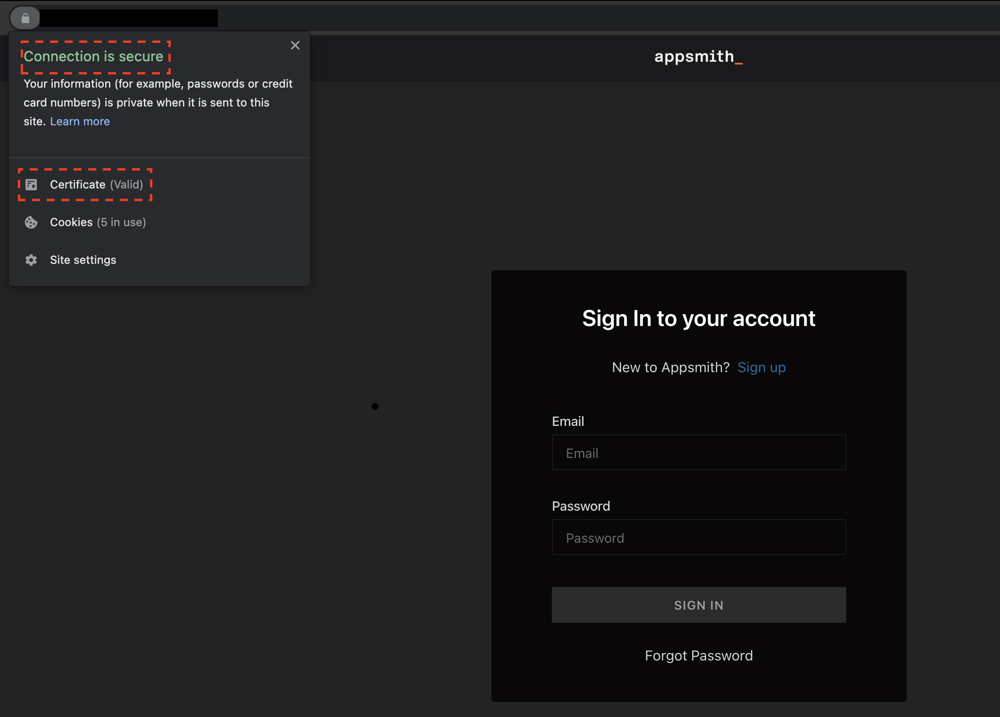

## Introduction
- Deploying Appsmith application on a Kubernetes cluster is easier with [Appsmith's Helm chart](). However, it is best practice to secure your web application with TLS certificates.

- This guide will show you how to secure HTTP traffic with TLS and SSL certificates using [Cert Manager](https://cert-manager.io/).

## Prerequisites
- You should have a Kubernetes cluster running with [Helm v3.x](https://helm.sh/docs/intro/install/) installed.
- Ensure `kubectl` is installed and configured to connect to your cluster:
  - Install kubeclt: [kubernetes.io/vi/docs/tasks/tools/install-kubectl/](https://kubernetes.io/vi/docs/tasks/tools/install-kubectl/)
    - Google Cloud Kubernetes: [Configuring cluster access for kubectl](https://cloud.google.com/kubernetes-engine/docs/how-to/cluster-access-for-kubectl)
    * Aws EKS: [Create a kubeconfig for Amazon EKS](https://docs.aws.amazon.com/eks/latest/userguide/create-kubeconfig.html)
    
## Secure traffic with TLS and Let's Encrypt SSL certificates
The Appsmith Helm chart comes with built-in support for Ingress routes and certificate management through [cert-manager](https://github.com/jetstack/cert-manager). This makes it easy to configure TLS support using certificates from a variety of certificate providers, including [Let's Encrypt](https://letsencrypt.org/).

The steps below explain how to use Ingress routes and cert-manager to configure TLS for your Appsmith deployment using a free Let's Encrypt certificate:

- Begin by installing the NGINX Ingress controller with Helm:
```shell
helm repo add ingress-nginx https://kubernetes.github.io/ingress-nginx
helm repo update

helm install ingress-nginx ingress-nginx/ingress-nginx
```
- Obtain the LoadBalancer IP address using the command below. Note this IP address as you will use it to configure DNS in a later step.
```
kubectl get svc ingress-nginx-controller -o jsonpath="{.status.loadBalancer.ingress[0].hostname}"
```
*Tip: It may take some time for the load balancer IP address to be assigned, so you may need to wait a few minutes before the command above returns any output.*
- Browse to the IP address and confirm that you see the default NGINX welcome page. This indicates that the NGINX Ingress controller is working.

- Configure the DNS for your domain name by adding an A record pointing to the public IP address obtained in the previous steps.

- Add the cert-manager repository, create a namespace and create CRDs:
```
helm repo add jetstack https://charts.jetstack.io

kubectl create namespace cert-manager
kubectl apply --validate=false -f https://github.com/jetstack/cert-manager/releases/download/v1.5.3/cert-manager.crds.yaml
```
*Tip: When executing these commands on Google Kubernetes Engine (GKE), you may encounter permission errors. [Refer to the official cert-manager documentation for notes on how to elevate your permissions](https://docs.cert-manager.io/en/latest/getting-started/install/kubernetes.html).*
- Create a ClusterIssuer resource for Let's Encrypt certificates. Create a file named letsencrypt-prod.yaml with the following content. Replace the EMAIL-ADDRESS placeholder with a valid email address.
```yaml
apiVersion: cert-manager.io/v1
kind: ClusterIssuer
metadata:
  name: letsencrypt-prod
spec:
  acme:
    email: EMAIL-ADDRESS
    server: https://acme-v02.api.letsencrypt.org/directory
    privateKeySecretRef:
      name: letsencrypt-prod
    solvers:
    - http01:
        ingress:
          class: nginx
```
- Apply the changes to the cluster:
```
kubectl apply -f letsencrypt-prod.yaml
```
- Install cert-manager with Helm and configure Let's Encrypt as the default Certificate Authority (CA):
```
helm install cert-manager --namespace cert-manager jetstack/cert-manager --version v1.5.3
```
- Install Appsmith using Helm chart with additional parameters to integrate with Ingress and cert-manager. Replace the DOMAIN placeholder with your domain name:
```
helm install appsmith/appsmith --generate-name \
--set service.type=ClusterIP \
--set ingress.enabled=true \
--set ingress.tls=true \
--set ingress.certManager=true \
--set ingress.annotations."kubernetes\.io/ingress\.class"=nginx \
--set ingress.annotations."cert-manager\.io/cluster-issuer"=letsencrypt-prod \
--set ingress.hosts[0].host=DOMAIN \
--set ingress.certManagerTls[0].hosts[0]=DOMAIN \
--set ingress.certManagerTls[0].secretName=letsencrypt-prod
```
After the deployment completes, visit the domain in your browser and you should see the Appsmith site over a secure TLS connection with a valid Let's Encrypt certificate.
<p>
  
</p>

## Useful links

To learn more about the topics discussed in this guide, use the links below:
- [Appsmith Helm chart](https://github.com/appsmithorg/appsmith/blob/release/deploy/helm/README.md)
- [Get Started with Kubernetes](https://kubernetes.io/docs/setup/)
- [Kubernetes Ingress](https://kubernetes.io/docs/concepts/services-networking/ingress/)
- [NGINX Ingress Controller documentation](https://github.com/kubernetes/ingress/tree/master/controllers/nginx)
- [Annotations supported by various Ingress controllers](https://github.com/kubernetes/ingress/blob/master/docs/annotations.md)