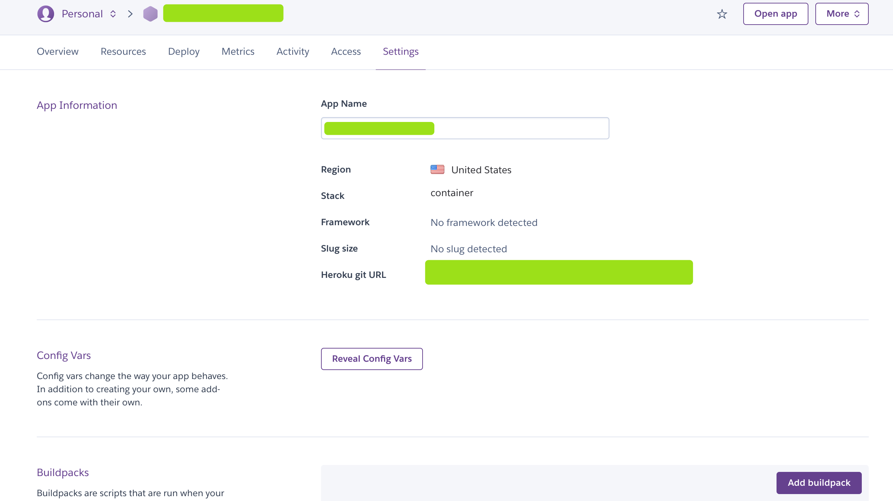
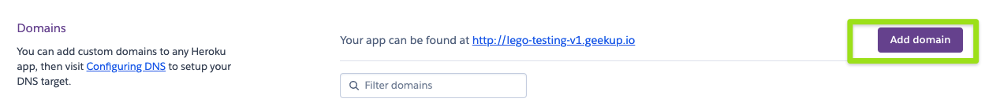
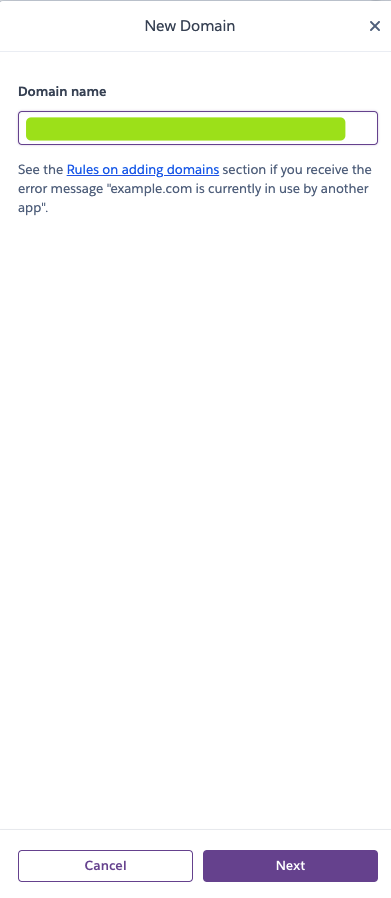
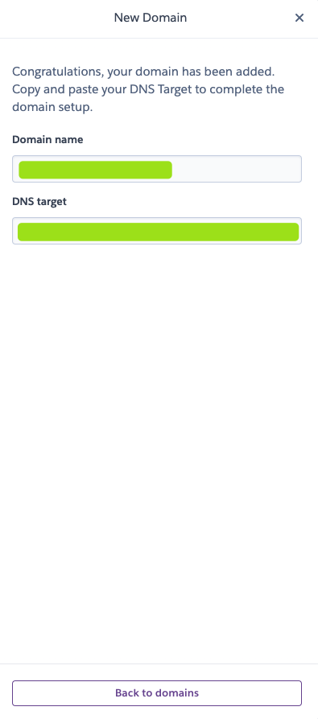

## Deploy Appsmith using Heroku

Quickly set up Appsmith to explore product functionality using Heroku.

## Heroku Installation

- Sign up for a free account on Heroku
- Click the [](https://heroku.com/deploy?template=https://github.com/appsmithorg/appsmith/tree/master) button
- Fill in the required `Config Variables` including:
  - `APPSMITH_ENCRYPTION_PASSWORD`: Encryption password to encrypt all credentials in the database
  - `APPSMITH_ENCRYPTION_SALT`: Encryption salt used to encrypt all credentials in the database
  - `APPSMITH_MONGODB_URI`: Your Mongo Database URI
- (Optional) Customize the default settings in Heroku

  - `App Name`: Optionally select a name for your application (this will be used in the app URL)
  - `Runtime Selection`: Select which region your app should run in (United States or Europe)
  - `Config Variables`:

    - Email Configuration:
      - `APPSMITH_MAIL_ENABLED`: Set this value to true to enable email sending (value should be `true/false` only)
      - `APPSMITH_MAIL_FROM`: Email ID using which emails will be sent from your installation
      - `APPSMITH_REPLY_TO`: Email ID to which all email replies will be sent to
      - `APPSMITH_MAIL_HOST`: The host endpoint for the SMTP server
      - `APPSMITH_MAIL_SMTP_TLS_ENABLED`: Set this value to enable TLS for your SMTP server (value should be `true/false` only)
      - `APPSMITH_MAIL_USERNAME`: SMTP username
      - `APPSMITH_MAIL_PASSWORD`: SMTP password
    - Oauth Configuration:
      - Google Oauth:
        - `APPSMITH_OAUTH2_GOOGLE_CLIENT_ID`: Client ID provided by Google for OAuth2 login
        - `APPSMITH_OAUTH2_GOOGLE_CLIENT_SECRET`: Client secret provided by Google for OAuth2 login
      - Github Oauth:
        - `APPSMITH_OAUTH2_GITHUB_CLIENT_ID`: Client ID provided by Github for OAuth2 login
        - `APPSMITH_OAUTH2_GITHUB_CLIENT_SECRET`: Client secret provided by Github for OAuth2 login
    - `APPSMITH_GOOGLE_MAPS_API_KEY`: Google Maps API key which is required if you wish to leverage Google Maps widget. Read more at: https://docs.appsmith.com/v/v1.2.1/setup/docker/google-maps
    - `APPSMITH_DISABLE_TELEMETRY`: We want to be transparent and request that you share anonymous usage data with us. This data is purely statistical in nature and helps us understand your needs & provide better support to your self-hosted instance. You can read more about what information is collected in our documentation https://docs.appsmith.com/v/v1.2.1/setup/telemetry
    - Google reCAPTCHA v3 Configuration:
      - `APPSMITH_RECAPTCHA_SITE_KEY`: Google reCAPTCHA v3 site key, it is required if you wish to enable protection against spam/abusive users. Read more at: https://developers.google.com/recaptcha/docs/v3
      - `APPSMITH_RECAPTCHA_SECRET_KEY`: Google reCAPTCHA v3 verification secret key, it is required if you wish to enable spam protection in your backend server.
      - `APPSMITH_RECAPTCHA_ENABLED`: Boolean config to enable or disable Google reCAPTCHA v3 verification feature. If set to true, both site key and secret key should be provided.
    - Intercom:
      - `APPSMITH_DISABLE_INTERCOM`: Set this value to true to disable intercom (value should be `true/false` only)

    After Heroku finishes setting up the app, click “View” and your Appsmith should be up and running. You will be taken to the account creation page, where you can enter credentials to create an account and get started.



- We use Heroku Redis addon for caching which required your account to have billing information, but we use the free plan of this addon so it will charge you nothing. Please make sure your account already finish providing billing information.
- You may need to wait 2 - 3 minutes before accessing the application.
  

## Custom domain

To create your custom domain with your app, please follow these steps below:

- Go to your app's settings tab
  
- Click `Add domain` button in Domains section
  
- Input your domain name & click `Next`. Heroku will provide you a DNS Target that you can map your domain with  
    
  

- Make sure that your DNS Record is update so that your custom domain will map to `DNS Target`

- Once you finish, now you can access Appsmith from your custom domain



- Once you use a custom domain, You might want to setup SSL for your dyno. Please check the official document of Heroku [how to configure SSL](https://devcenter.heroku.com/articles/ssl)
- Your dyno will need to be upgrade to at least `hobby` type to use this feature of heroku



## Re-Deploy your App using Heroku CLI

To re-deploy your app (re-build & re-run), make sure you have Docker & Heroku CLI setup locally then follow steps below:

- Pull the appsmith repository & move to `heroku` folder:
  ```
  git clone --branch master https://github.com/appsmithorg/appsmith
  cd ./appsmith/deploy/heroku
  ```
- Login to Heroku CLI
  ```
  heroku login
  ```
- Login to Container Registry
  ```
  heroku container:login
  ```
- Get your application name
  ```
  heroku apps
  ```
- Push your Docker-based app
  ```
  heroku container:push web -a <Your App Name>
  ```
- Deploy the changes
  ```
  heroku container:release web -a <Your App Name>
  ```
