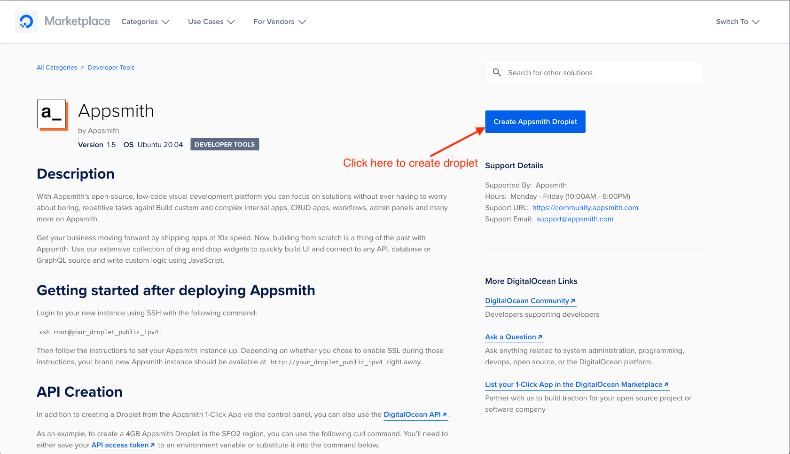
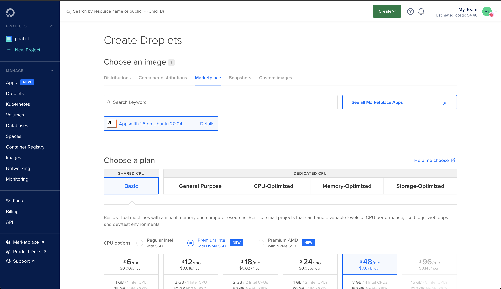
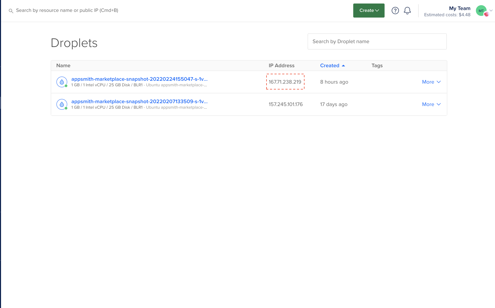

# Introduction
In this tutorial, we will show you how to create and provision Appsmith on a DigitalOcean Droplet using a public `One-Click Application` on DigitalOcean Marketplace

# Deploy Appsmith on DigitalOcean
- We have already published Appsmith as an `One-Click Application` on DigitalOcean Marketplace. Please access the following link to create `Appsmith Droplet` from Marketplace [https://marketplace.digitalocean.com/apps/appsmith](https://marketplace.digitalocean.com/apps/appsmith)
 .
- It will take you to the `Create Droplets` page with the pre-selected image is `Appsmith`. In this page, you can choose your configuration for your droplet(s) to run Appsmith.

- After creating droplet, you just need to wait for your droplet to be ready. Then, you can access Appsmith with the public IP address of the droplet.


# Connect to Droplet
- To connect to your droplet, you can tunnel to droplet using SSH with the following command:
```
ssh -i <ssh-key-path> appsmith@<server-ip>
```