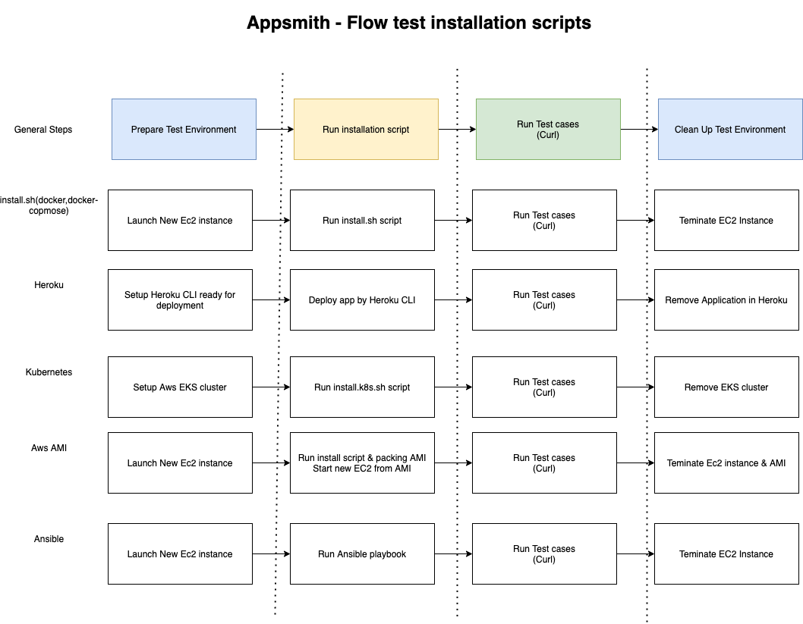
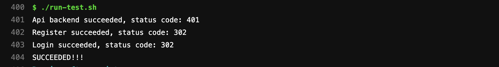
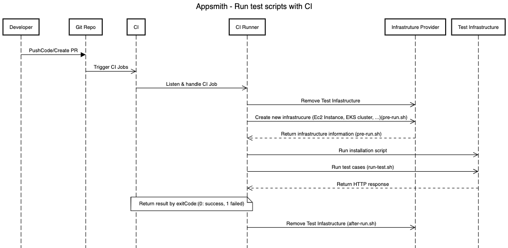
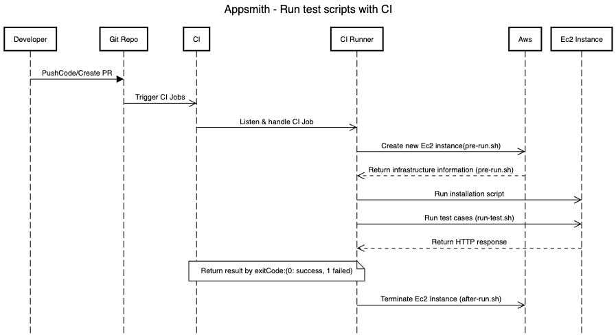
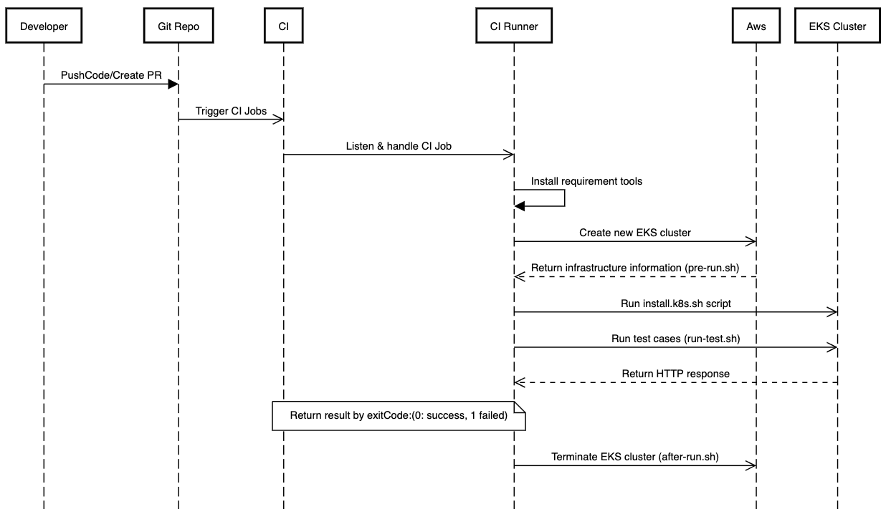
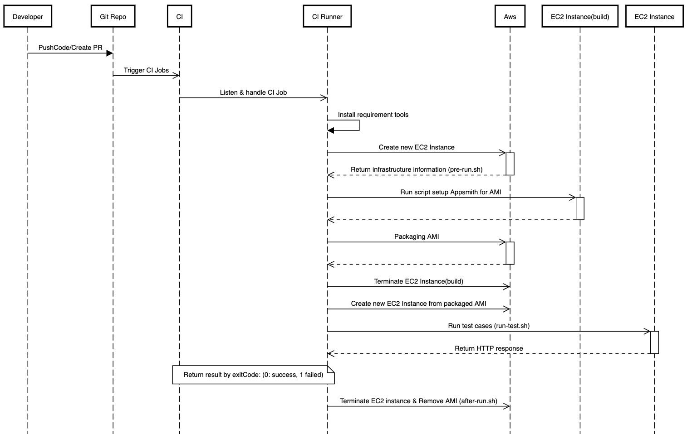

# Test scripts for installation scripts
### Goal: Automate flow testing deployment script to ensure that the installation script is always working as expected
## I. Approach for testing
In general, Test script will prepare test environment, then run the installation script, after installation script completed, we'll run the testcase by call HTTP request to server to make sure that it working as expected
### 1. Flow testing

### 2. Test cases
- Call 3 APIs to Server by CURL then return exit-code: 
    - 0: Success 
    - 1: error


### 3. Flow integration with CI System

## II Guide to run test for each platforms

**Important:**

- Before your CI Runner runs any script below, make sure that your runner is in the right folder
```
    cd <your_repository>/deploy/test-scripts/<testing_platform>
```
- Also make sure that your CI Runner always has `GITHUB_WORKSPACE` environment variable point to `<your_repository>` folder path
- Our script will install all necessary packages before running test scripts, please make sure that CI runner have authority to install packages
### 1. Install.sh ( docker, docker-compose)
**Diagrams:**


**Environment Variables:**
```
- AWS_ACCESS_KEY_ID: for AWS provider in terraform
- AWS_DEFAULT_REGION: for AWS provider in terraform
- AWS_SECRET_ACCESS_KEY: for AWS provider in terraform
- AWS_KEY_PAIR_NAME: Your AWS Key Pair (used when create EC2 using terraform)
- SSH_PRIVATE_KEY: Your private key (used to connect to EC2 after it is created)
```
**Prepare test:**
- Make sure that `Environment Variables` existed in shell before run the script below
- Run script `pre-run.sh`:
```
./pre-run.sh
```
- This script will start new EC2 instance then run the install.sh script with default prompt configuration (for detail, please read `script.exp` file )
- At the end of this step, Appsmith application is deployed on new EC2 instance by install.sh script.

**Run test:**
```
./run-test.sh
```
- This script will call to new server 3 API by CURL then return result via exitCode
    - `0`: Success, 3 api response status as expected
    - `1`: Failed, Some things when wrong, please check console output for more information

**After test:**
- Run after-run.sh to clean up test environment
```
./after-run.sh
```
### 2. Install.k8s.sh (Kubernetes)
**Diagrams:**


**Environment Variables:**
```
- AWS_ACCESS_KEY_ID: for AWS provider in terraform
- AWS_DEFAULT_REGION: for AWS provider in terraform
- AWS_SECRET_ACCESS_KEY: for AWS provider in terraform
```
**Prepare test:**
- Make sure that `Environment Variables` existed in shell before run the script below
- Run script `pre-run.sh`:
```
./pre-run.sh
```
- This script will start new EKS cluster then run the install.k8s.sh script with default prompt configuration
- At the end of this step, Appsmith application is deployed

**Run test:**
```
./run-test.sh
```
- This script will call to new server 3 API by CURL then return result via exitCode
    - `0`: Success, 3 api response status as expected
    - `1`: Failed, Some things when wrong, please check console output for more information

**After test:**
- Run after-run.sh to clean up test environment
```
./after-run.sh
```

### 3. Aws AMI 
**Diagrams:**

**Environment Variables:**
```
- AWS_ACCESS_KEY_ID: for AWS provider in terraform
- AWS_DEFAULT_REGION: for AWS provider in terraform
- AWS_SECRET_ACCESS_KEY: for AWS provider in terraform
- AWS_KEY_PAIR_NAME: Your AWS Key Pair (used when create EC2 using terraform)
- SSH_PRIVATE_KEY: Your private key (used to connect to EC2 after it is created)
```

**Prepare test:**
- Make sure that `Environment Variables` existed in shell before run the script below
- Run script `pre-run.sh`:
```
./pre-run.sh
```
- This script will start new EC2 instance, then upload all necessary files to run Appsmith to that instance. After that, the script will bundle a new AWS AMI then shut down the old instance. Then the script will start new EC2 instance using the new AMI its just built.
- At the end of this step, Appsmith application is deployed on the new EC2 instance
**Run test:**
```
./run-test.sh
```
- This script will call to new server 3 API by CURL then return result via exitCode
    - `0`: Success, 3 api response status as expected
    - `1`: Failed, Some things when wrong, please check console output for more information

**After test:**
- Run after-run.sh to clean up test environment
```
./after-run.sh
```
### 4. Heroku 
**Diagrams:**

**Environment Variables:**
```
- HEROKU_USERNAME: heroku account username
- HEROKU_API_KEY: heroku account API key 
- MONGO_URI: Mongo DB URI 
```
**Note**: Those environment variables will help authenticate to heroku CLI

**Prepare test:**
- Make sure that `Environment Variables` existed in shell before run the script below
- Run script `pre-run.sh`:
```
./pre-run.sh
```
- This script will config & deploy application on Heroku by Heroku CLI
- At the end of this step, Appsmith application is deployed
**Run test:**
```
./run-test.sh
```
- This script will call to new server 3 API by CURL then return result via exitCode
    - `0`: Success, 3 api response status as expected
    - `1`: Failed, Some things when wrong, please check console output for more information

**After test:**
- Run after-run.sh to clean up test environment
```
./after-run.sh
```

### 5. Ansible
**Diagrams:**

**Environment Variables:**
```
- AWS_ACCESS_KEY_ID: for AWS provider in terraform
- AWS_DEFAULT_REGION: for AWS provider in terraform
- AWS_SECRET_ACCESS_KEY: for AWS provider in terraform
- AWS_KEY_PAIR_NAME: Your AWS Key Pair (used when create EC2 using terraform)
- SSH_PRIVATE_KEY: Your private key (used to connect to EC2 after it is created)
```

**Prepare test:**
- Make sure that `Environment Variables` existed in shell before run the script below
- Run script `pre-run.sh`:
```
./pre-run.sh
```
- This script will start new EC2 instance then run the ansible playbook to deploy Appmisth on EC2 instance
- At the end of this step, Appsmith application is deployed
**Run test:**
```
./run-test.sh
```
- This script will call to new server 3 API by CURL then return result via exitCode
    - `0`: Success, 3 api response status as expected
    - `1`: Failed, Some things when wrong, please check console output for more information

**After test:**
- Run after-run.sh to clean up test environment
```
./after-run.sh
```
## III. Notes & Known issues
